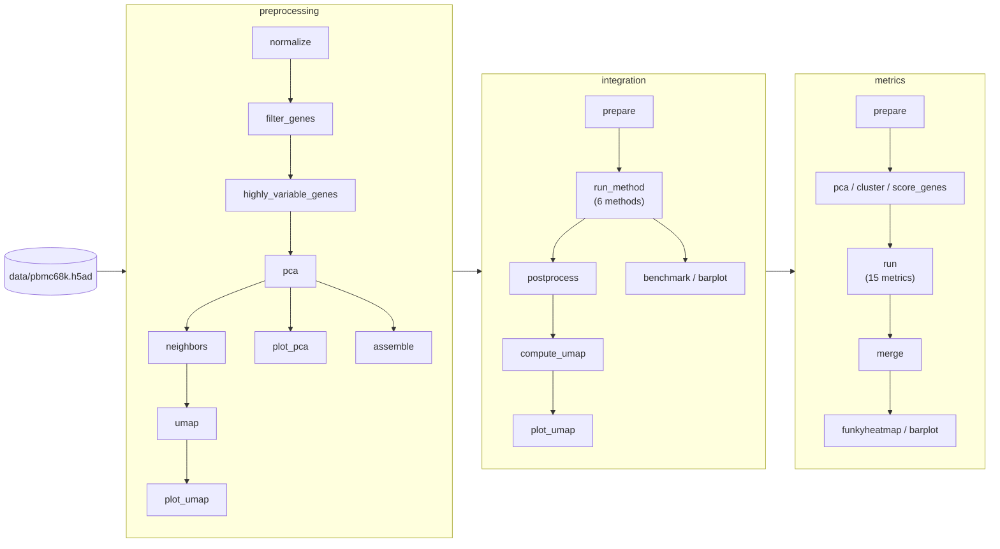

# 🚀 Quickstart: demo

This demo runs a small but complete atlas-integration benchmark on the example dataset that ships with the toolbox.
It covers three modules:

1. **preprocessing**: normalization, highly variable gene selection, PCA, kNN graph and UMAP
2. **integration**: batch correction with several methods (`unintegrated` baseline, ComBat, BBKNN, Harmony (harmonypy and harmony-pytorch) and Scanorama)
3. **metrics**: benchmarking the integration results with [scIB metrics](https://scib.readthedocs.io/en/latest/)

The demo runs entirely on CPU and does not download any data.



*Simplified rule graph of the demo, condensed from `snakemake --rulegraph` (32 rules). Jobs are created per input file, integration method, output type and metric, so the demo runs 341 jobs. The complete rule graph of each module is shown on its {doc}`module page <../modules/index_integration>`.*

## Prerequisites

1. You have cloned the repository and installed the [demo environments](installation.md#environments-for-the-demo).
2. All commands are run from the root of the repository.

### Demo dataset

The demo uses `data/pbmc68k.h5ad` (2.4 MB), which is part of the repository.
It is derived from the `pbmc68k_reduced` dataset of [scanpy](https://scanpy.readthedocs.io/en/stable/generated/scanpy.datasets.pbmc68k_reduced.html) (700 peripheral blood mononuclear cells, 765 genes) and was created with `data/create_data.py`, which adds:

* `obs['batch']`: 3 simulated batches with an artificial batch effect added to the counts
* `layers['counts']`: raw counts
* `layers['normcounts']`: log-normalized counts
* `obs['bulk_labels']`: cell type labels, used as the biological label for the metrics

### Demo configuration

The demo is configured in `configs/quickstart.yaml`:

```{eval-rst}
.. literalinclude:: ../../configs/quickstart.yaml
   :language: yaml
   :caption: configs/quickstart.yaml
```

The pipeline is called through `run_example.sh`, which passes the configuration file and the local [Snakemake profile](../principles/advanced.rst) (`.profiles/local`) to Snakemake.

## 1. Dry run

Activate the snakemake environment

```
conda activate snakemake
```

Call the pipeline with `-n` for a dry run and `-q` for reduced output.
Here's the command for running preprocessing, integration and metrics:

```
bash run_example.sh preprocessing_all integration_all metrics_all -nq
```

```
Job stats:
job                                    count
-----------------------------------  -------
integration_all                            1
integration_barplot_per_dataset            3
integration_benchmark_per_dataset          1
integration_compute_umap                   9
integration_plot_umap                      9
integration_postprocess                    9
integration_prepare                        1
integration_run_method                     6
metrics_all                                1
metrics_barplot                            3
metrics_barplot_per_dataset                3
metrics_cluster                           90
metrics_cluster_collect                    9
metrics_collect                            9
metrics_funkyheatmap                       1
metrics_funkyheatmap_per_dataset           1
metrics_merge                              1
metrics_merge_per_batch                    1
metrics_merge_per_dataset                  1
metrics_merge_per_file                     9
metrics_merge_per_label                    1
metrics_pca                                9
metrics_prepare                            9
metrics_run                              135
metrics_score_genes                        9
preprocessing_all                          1
preprocessing_assemble                     1
preprocessing_filter_genes                 1
preprocessing_highly_variable_genes        1
preprocessing_neighbors                    1
preprocessing_normalize                    1
preprocessing_pca                          1
preprocessing_plot_pca                     1
preprocessing_plot_umap                    1
preprocessing_umap                         1
total                                    341

This was a dry-run (flag -n). The order of jobs does not reflect the order of execution.
```

> 📝 **Note** Snakemake options that take a value (such as `-q`) must come after the targets, otherwise Snakemake interprets the first target as the option's value.

## 2. Run the demo

If the dry run was successful, you can let Snakemake compute the different steps of the workflow, e.g. with 4 cores:

```
bash run_example.sh preprocessing_all integration_all metrics_all -c 4
```

**Expected run time:** ~15 minutes with 4 CPU cores (measured on a laptop with Apple M1 Pro and 16 GB RAM; 341 jobs), excluding the installation of the conda environments.

## 3. Expected output

Large files (AnnData objects in [zarr](https://anndata.readthedocs.io/en/latest/generated/anndata.read_zarr.html) format) are written to `data/out/` and plots and summary tables to `images/`, as specified by `output_dir` and `images` in the configuration.
Directory names encode the wildcards of each step (e.g. `dataset~my_task`, `method~harmonypy`); `<hash>` stands for a short hash of the method's hyperparameters or input file id.

```
data/out/
├── preprocessing/
│   └── dataset~my_task/file_id~file_1.zarr            # preprocessed data (normalized, HVGs, PCA, kNN graph, UMAP)
├── integration/
│   ├── dataset~my_task/file_id~preprocessing:file_1/batch~batch/var_mask~None/
│   │   ├── method~unintegrated--...--output_type~{full,embed,knn}.zarr
│   │   ├── method~combat--...--output_type~full.zarr      # corrected expression matrix
│   │   ├── method~bbknn--...--output_type~knn.zarr        # corrected kNN graph
│   │   ├── method~harmonypy--...--output_type~embed.zarr  # corrected embedding
│   │   ├── method~harmony_pytorch--...--output_type~embed.zarr
│   │   └── method~scanorama--...--output_type~{full,embed}.zarr
│   └── dataset~my_task/integration.benchmark.tsv      # run time and memory per method
└── metrics/
    └── results/
        ├── metrics.tsv                                # all metric scores (long format)
        └── dataset~my_task/metrics.tsv                # metric scores for this task

images/
├── preprocessing/dataset~my_task/file_id~file_1/
│   ├── pca/None.png                                   # PCA plot
│   └── umap/None.png                                  # UMAP plot
├── integration/
│   ├── umap/dataset~my_task/.../method~<method>.../output_type~<type>/batch.png   # UMAP per integration output
│   └── benchmark/dataset~my_task/metric~{s,max_uss,mean_load}.png        # run time, memory and CPU load per method
└── metrics/
    ├── all/                                           # summaries across all tasks
    └── dataset~my_task/
        ├── funky_heatmap.pdf                          # overview of all metrics and aggregated scores per method
        ├── funky_heatmap_overall_metrics.pdf          # aggregated batch correction and bio-conservation scores
        ├── funky_heatmap.tsv                          # table underlying the heatmap
        ├── score-barplot.png                          # metric scores per method
        └── {s,max_uss}-barplot.png                    # run time and memory of metric computation
```

The main results of the demo are:

* **Integration UMAPs** (`images/integration/umap/...`): for each method and output type, a UMAP coloured by `batch`.
  Compared to `unintegrated`, the integrated outputs should show cells of the 3 batches more evenly mixed.
* **Benchmark table** (`data/out/metrics/results/dataset~my_task/metrics.tsv`): one row per method, output type and metric, with columns such as `integration_method`, `output_type`, `metric`, `metric_type` (`batch_correction` or `bio_conservation`), `batch`, `label` and `score`.
* **Funky heatmap** (`images/metrics/dataset~my_task/funky_heatmap.pdf`): ranking of the integration methods by aggregated batch correction and bio-conservation scores.

> You have now successfully called the example pipeline! 🎉
> Read on to learn how to configure your own workflow.

## Optional: GPU methods

If you have an NVIDIA GPU, you can additionally run deep-learning-based integration methods.
Install the `scvi-tools` environment (see [Working with GPUs](../principles/troubleshooting.md#working-with-gpus)), set `use_gpu: true` and uncomment the GPU methods in `configs/quickstart.yaml`:

```yaml
use_gpu: true

DATASETS:
  my_task:
    integration:
      methods:
        ...
        scvi:
          max_epochs: 10
          early_stopping: true
        drvi:
          max_epochs: 10
          early_stopping: true
        sysvi:
          max_epochs: 10
          early_stopping: true
          system_key: phase
```
