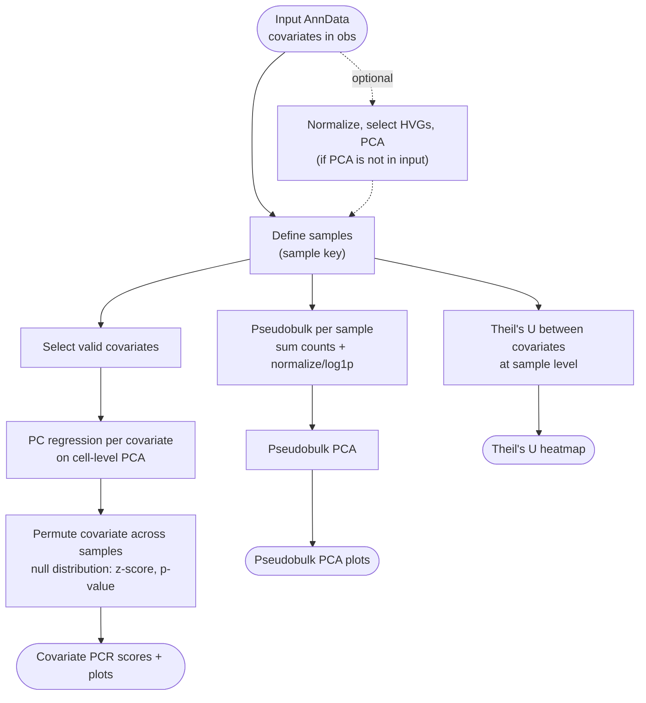

# Batch Analysis



*Conceptual overview of the main steps of the module. See the [functional description](#functional-description) below for details.*

```{include} ../../workflow/batch_analysis/README.md
:heading-offset: 1
```

## Functional description

### Inputs

- Input AnnData (`input: batch_analysis: {file_id: path}`), `.zarr` or `.h5ad`.
- `.obs`: the `sample` column(s) (comma-separated, joined with `-` into `obs['group']`) and all `covariates` / `permute_covariates`.
- `.obsm['X_pca']` and `.uns['pca']['variance']` (cell-level PCA with variances as stored by `scanpy.pp.pca`). These are either present in the input or computed by the optional preprocessing steps.
- The count slot `raw_counts` (default `X`) is aggregated into pseudobulks.

### Processing steps

The rule order follows the DAG. Preprocessing and pseudobulk rules are reused from the preprocessing and sample_representation modules (see {ref}`architecture`).

1. **Optional preprocessing** (preprocessing scripts, environment `scanpy` or `rapids_singlecell` on GPU): `batch_analysis_normalize` (`sc.pp.normalize_total` + `sc.pp.log1p` with the `normalize` arguments), `batch_analysis_filter_genes`, `batch_analysis_highly_variable_genes` (`sc.pp.highly_variable_genes` with the `highly_variable_genes` arguments) and `batch_analysis_pca` (`sc.pp.pca` with the `pca` arguments on the genes in `var[mask_var]`, default `highly_variable`). Steps are chained through `get_file`: a step reads the previous step's output only if that step's key is configured, otherwise it reads the original input. As a result, a step only runs if its own key and all downstream keys are configured (see the note in Configuration above).
2. **`batch_analysis_prepare`** (sample_representation `scripts/prepare.py`, environment `scanpy`, always with dask): reads `raw_counts` from the (preprocessed) file, sets `obs['group']` from `sample`, aggregates sum-pseudobulks per group with `get_pseudobulks` (groups with fewer than 2 cells are dropped), then `sc.pp.normalize_total` + `sc.pp.log1p`. Writes the cell-level `prepare.zarr` (input + `obs['group']`) and `pseudobulks.zarr`.
3. **`batch_analysis_pb_pca`** → **`batch_analysis_pb_pca_plot`** (preprocessing `pca.py` / `plot.py`, environment `scanpy`): PCA on the pseudobulks (with the `pca` arguments), then `sc.pl.embedding(basis='X_pca')` colored by each covariate. Point size, centroid labels and gene chunk size come from `pca_plot`.
4. **`batch_analysis_determine_covariates`** (checkpoint, script `scripts/determine_covariates.py`, environment `scanpy`, local rule). Requires `obs['group']`.

   ```text
   perm_covariates := permute_covariates or covariates
   for c in covariates (and perm_covariates):
       valid(c) := c in obs
                   and values in na_strings / NaN are masked
                   and numeric:      > 1 unique non-NA value
                       categorical:  exactly one value per group (else warn + skip)
                                     and >= 2 unique non-NA values
   perm_covariates := valid perm_covariates without 'group'
   for c in valid covariates ∪ perm_covariates:
       write covariate_setup/<c>.yaml: n_permute = n_permutations if c in perm_covariates else 0,
                                       is_numeric, na_strings
   ```

   The set of `{covariate}` wildcards for the next rules is the set of YAML files written here.
5. **`batch_analysis_batch_pcr`** (script `scripts/batch_pcr.py`, environment `scib`, one job per covariate, threads = `min(max_threads, n_permutations)`). Runs on the **cell-level** `X_pca` of `prepare.zarr`.

   ```text
   X := obsm['X_pca'] (float32), var := uns['pca']['variance'] (length must equal n_PCs)
   drop cells with covariate in na_strings or NaN
   numeric: cast to float32; categorical: cast to category
       if every covariate value occurs in only one group (covariate ≡ sample): n_permute := 0
   score(i):
       i == 0: y := observed covariate
       numeric: y := random permutation over all cells (rng seeded with [i, 42])
       categorical: permute the per-group covariate values (one value per group),
                    redraw up to 1000× until different from the original, else NaN;
                    map back to cells via the group codes
       return scib.me.pc_regression(X, pca_var=var, covariate=y, linreg_method='numpy')
   run score(0..n_permute) in parallel (joblib loky, chunks of 10·threads)
   if n_permute == 0: add the observed score once more as "permuted"
   perm_mean, perm_std := mean/std of permuted scores
   z_score := (pcr - perm_mean) / perm_std
   if n_permute == 0:   p-val := NaN
   elif n_permute < 100: signif := '**' if z > 3, '*' if z > 1.5;
                         p-val := #(permuted with z > 1.5) / n_permute
   else:                p-val := (#{|perm - perm_mean| >= |obs - perm_mean|} + 1) / (n_permute + 1)
                         signif := '**' if p <= 0.01, '*' if p <= 0.05
   ```

   `scib.me.pc_regression` returns the PCA-variance-weighted sum of the R² of a linear regression of each PC on the covariate (one-hot encoded for categorical covariates). Permuting at sample level keeps the sample structure intact, so the null distribution reflects the variance a random sample-level assignment of the covariate would explain.
6. **`batch_analysis_batch_pcr_collect`** (local `run` block): concatenates all per-covariate TSVs. If there are none, it writes an empty table.
7. **`batch_analysis_batch_pcr_plot`** (script `scripts/plot.py`, environment `scanpy`): covariates sorted by PCR score. The barplot shows observed vs. permuted scores (± SD) annotated with z-score and significance. The violin plot shows a boxen plot of permuted scores with the observed score as a red dot. A side panel shows the number of unique values per covariate. Empty input produces blank figures.
8. **`batch_analysis_theils_u`** (script `scripts/theils_u.py`, environment `scanpy`). Runs on the `.obs` of the original input (independent of the PCR branch).

   ```text
   sample_key := composite of `sample` columns ('-'-joined), or obs index if unset
   keep covariates in obs with >= 2 non-NA unique values;
       drop numeric covariates with > 10 unique values
   aggregate each covariate per sample by its mode; drop covariates that are constant afterwards
   for each pair (x, y): U(x|y) = (H(x) - H(x|y)) / H(x)   (log2 entropies; diagonal = 1)
   ```

   The asymmetric matrix is written as TSV and plotted as a seaborn clustermap with dendrograms and a side bar plot of the number of unique values per covariate.

### Outputs

Relative to `<output_dir>/batch_analysis/` and `<images>/batch_analysis/`, with `<pattern>` = `dataset~<dataset>/file_id~<file_id>`.

| Path | Content |
|---|---|
| `prepare/<pattern>/{normalize,filter_genes,highly_variable_genes,pca}.zarr` | optional preprocessing outputs |
| `prepare/<pattern>/prepare.zarr` | cell-level object + `obs['group']` |
| `prepare/<pattern>/pseudobulks.zarr` | log-normalized pseudobulks |
| `prepare/<pattern>/pseudobulk_pca.zarr` | + `obsm['X_pca']`, `uns['pca']` |
| `<pattern>/batch_pcr/covariate_setup/<covariate>.yaml` | permutation setup per covariate |
| `<pattern>/batch_pcr/<covariate>.tsv` | one row per observed/permuted run: `covariate`, `permuted`, `pcr`, `covariate_type`, `n_covariates`, `perm_mean`, `perm_std`, `z_score`, `p-val`, `signif` |
| `<pattern>/batch_pcr.tsv` | all covariates combined |
| `<pattern>/theils_u.tsv` | Theil's U matrix (rows x, columns y) |
| `<images>/…/<pattern>/batch_pcr_bar.png`, `batch_pcr_violin.png` | PCR plots |
| `<images>/…/<pattern>/theils_u_heatmap.png` | Theil's U clustermap |
| `<images>/…/<pattern>/pca_plots/` | pseudobulk PCA plots |

### Environments

- `scanpy`: preprocessing, pseudobulks, covariate setup, plots, Theil's U. `rapids_singlecell` replaces it for normalization, HVG and PCA when `use_gpu: true`.
- `scib`: `batch_pcr`.
