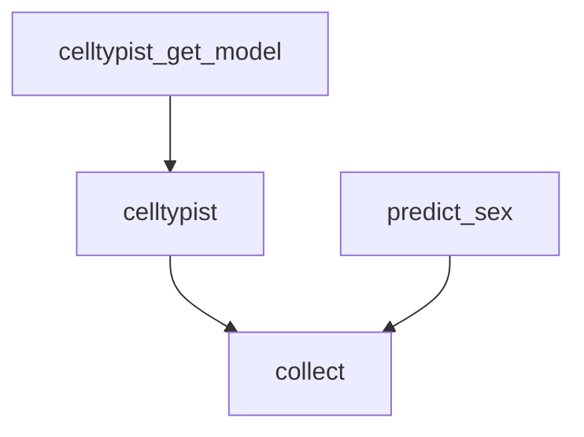

# Cell Type Prediction



*Rule graph of the `celltype_prediction` module with all steps enabled, generated with `snakemake --rulegraph`. Grey rounded nodes are upstream modules; rule names correspond to the processing steps described below.*

```{include} ../../workflow/celltype_prediction/README.md
:heading-offset: 1
```

## Functional description

### Inputs

* **File formats:** `.h5ad` or `.zarr` (AnnData), configured under `input: celltype_prediction:` (see {ref}`architecture`).
* **Expression matrix:** the slot named by `counts` (default: `X`), read lazily with dask. For CellTypist it is normalised in the workflow unless `is_normalized: true` (default `false`); sex prediction uses it as is (`is_normalized` is passed but not used by the script).
* **`.var`:** if `feature_name` exists it replaces `var_names` (CellTypist models and sex marker genes are matched on gene symbols); otherwise `var_names` are used.
* **`.obs`:** optional `reference_label` (must exist if set); `celltypist.params.over_clustering` column if given; `predict_sex.donor_key` (required for sex prediction) and optionally `predict_sex.reference_key`.
* **`.obsm`, `.obsp`, `.uns`:** read only when `celltypist.params.majority_voting` is `true` and no `over_clustering` column is given, so that CellTypist can over-cluster on an existing neighbour graph.
* **Models:** `celltypist.models` lists CellTypist model names; the parameter space is exploded so each model is its own `celltypist_model` wildcard.

### Processing steps

1. **`celltype_prediction_celltypist_get_model`** (script `scripts/get_celltypist_model.py`, environment `celltypist`). Sets `CELLTYPIST_FOLDER=<output_dir>/celltype_prediction/models/celltypist`, downloads the model with `celltypist.models.download_models(model='<model>.pkl', force_update=True)` (network access required) and hard-links it to `<model>.pkl` in that folder.

2. **`celltype_prediction_celltypist`** (script `scripts/celltypist.py`, environment `celltypist`). One job per file × model.
   ```text
   read X=<counts>, obs, var (+ obsm, obsp, uns, see Inputs)
   obs_names_make_unique() (original names restored before writing)
   if not is_normalized: scanpy.pp.normalize_total(target_sum=1e4); scanpy.pp.log1p
   load matrix into memory
   model = celltypist.models.Model.load(<model>.pkl)
   predictions = celltypist.annotate(adata, model=model, **celltypist.params)
                 # e.g. majority_voting, over_clustering, mode, p_thres
   if reference_label:
       celltypist.dotplot(predictions, use_as_reference=reference_label,
                          use_as_prediction="predicted_labels")      -> predicted_labels.png
       if majority_voting: same with use_as_prediction="majority_voting" -> majority_voting.png
   obs = predictions.to_adata(insert_labels=True, insert_conf=True,
                              prefix=f"celltypist_{model}:").obs, keep prefixed columns
   ```
   With `majority_voting: true`, CellTypist refines per-cell predictions by assigning each over-cluster (the given `over_clustering` column, or a Leiden over-clustering computed by CellTypist) its most frequent predicted label.

3. **`celltype_prediction_predict_sex`** (script `scripts/predict_sex.py`, environment `scanpy`). Only scheduled when `predict_sex` is configured.
   ```text
   assert donor_key in obs; restrict to `donors` if given (all must be present)
   resolve gene lists via utils.accessors.match_genes on var['feature_name']
       (entries may be gene names, local text files or URLs; each list must match ≥1 gene)
   # rule 1: X/Y expression
   per cell: x = mean expression of x_genes (default XIST); y = mean of y_genes
             (default FAM197Y6, FAM197Y7, FAM41AY2, LINC00279, SRY, TTTY1B)
   per donor: X, Y = sum over cells; y/x and x/y ratios (inf if denominator is 0)
   label = female  if (X > x_threshold and Y <= y_threshold) or Y/X <= imbalance_frac
           male    elif (X <= x_threshold and Y > y_threshold) or X/Y < imbalance_frac
           mix     elif (X > x_threshold and Y > y_threshold) or (both ratios > imbalance_frac)
           NaN     otherwise
   # rule 2: chrY non-PAR / PAR ratio (AIDA gene lists fetched from GitHub by default)
   per donor: ratio = sum(UMIs of non-PAR genes) / sum(UMIs of PAR genes) (inf if PAR = 0)
   label_chrY = male if ratio >= chrY_threshold (default 0.5) else female
   broadcast donor labels to cells
   if reference_key in obs: accuracy = fraction of cells with reference in {male, female}
                            matching each prediction; mismatching donors are logged
   ```
   Defaults: `x_threshold=0`, `y_threshold=4`, `imbalance_frac=0.1`, `predict_column='sex'`, `reference_key=predict_column`.

4. **`celltype_prediction_collect`** (script `scripts/collect.py`, environment `scanpy`). Adds the `.obs` columns of all CellTypist outputs (and of the sex prediction output, plus its `.uns['predict_sex']`) to the input `.obs` and writes `obs` (and `uns`) zarr-linked to the input.

### Outputs

Relative to `<output_dir>/celltype_prediction/`:

* `dataset~<dataset>/file_id~<file_id>.zarr` — final object. Per model, `.obs` columns `celltypist_<model>:predicted_labels`, `celltypist_<model>:conf_score`, and with majority voting `celltypist_<model>:over_clustering` and `celltypist_<model>:majority_voting`. With `predict_sex`: `.obs['<predict_column>']`, `.obs['<predict_column>_chrY']`, and `.uns['predict_sex']` with `X_Y_expression` (`predictions` per donor with `<predict_column>_x_exp`, `<predict_column>_y_exp`, label; gene lists; thresholds; `accuracy` if a reference exists) and `chrY_ratio` (`predictions` with `chrY_nonPAR_UMIs`, `chrY_PAR_UMIs`, `nonPAR_to_PAR`, label; gene lists; `accuracy`).
* `celltypist/dataset~<dataset>/file_id~<file_id>/<model>.zarr` — per-model predictions in `.obs`.
* `predict_sex/dataset~<dataset>/file_id~<file_id>.zarr` — sex predictions.
* `models/celltypist/<model>.pkl` — downloaded models.

Relative to `<images>/celltype_prediction/dataset~<dataset>/file_id~<file_id>/`:

* `celltypist--<model>/predicted_labels.png`, `celltypist--<model>/majority_voting.png` — CellTypist dot plots of reference vs. predicted labels (only with `reference_label`).

### Environments

* `celltypist` — model download and prediction.
* `scanpy` — sex prediction and collection (no GPU path).
