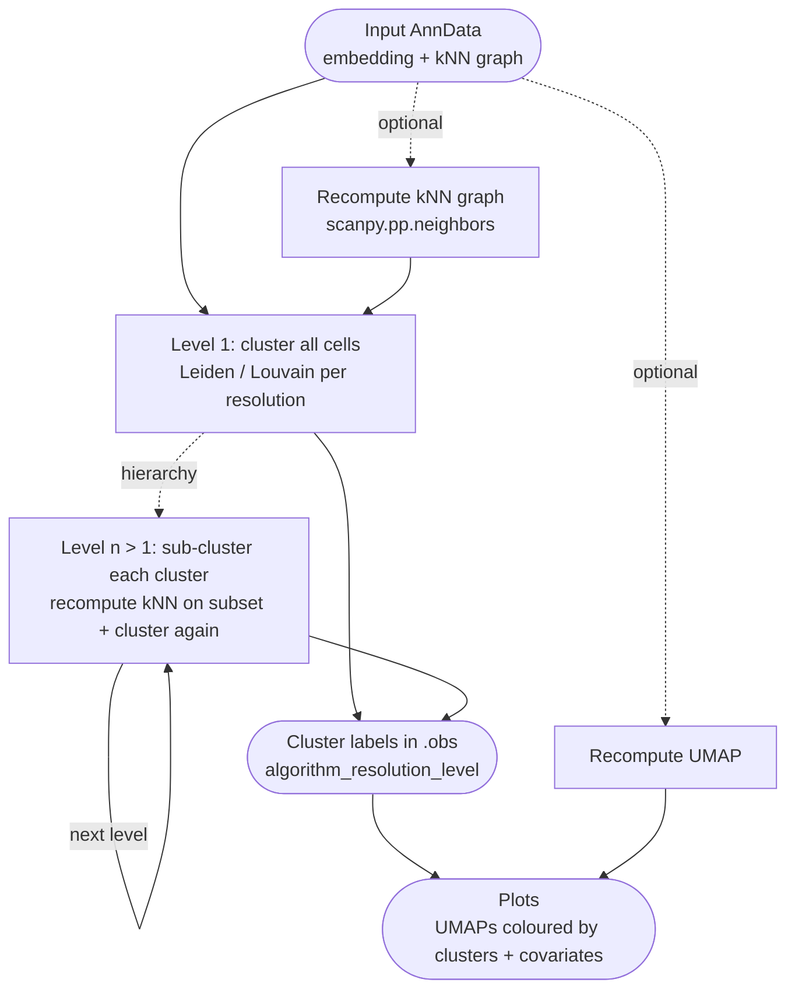

# Clustering



*Conceptual overview of the main steps of the module. See the [functional description](#functional-description) below for details.*

```{include} ../../workflow/clustering/README.md
:heading-offset: 1
```

## Functional description

### Inputs

* **File formats:** `.h5ad` or `.zarr` (AnnData), configured under `input: clustering:` (see {ref}`architecture`).
* **Neighbour graph (level 1):** `.uns[<neighbors_key>]` (config `neighbors_key`, default `neighbors`) is read to look up `connectivities_key`/`distances_key` (defaults `connectivities`/`distances`); the corresponding `.obsp` matrices are loaded. If `recompute_neighbors: true`, the graph is first recomputed (see step 1) and read from that intermediate file instead.
* **Embedding (levels > 1):** `.obsm[use_rep]`, where `use_rep` is taken from config `neighbors.use_rep` (default `X_pca`). If that key is absent from `.obsm`, `use_rep` is taken from `.uns/neighbors/params/use_rep`; the script fails if neither exists.
* **UMAP:** `.obsm['X_umap']` of the input is used for plotting unless `recompute_umap: true`.
* **Plot covariates:** `.obs` columns listed in `umap_colors` (and `plots.colors`, `plots.plot_centroids`).
* The parameter space is expanded per dataset over `algorithm` (allowed: `leiden`, `louvain`; anything else fails at DAG construction) × `resolutions` × hierarchy `level`. `hierarchy` is parsed by `ClusteringConfig.py`:
  * not set → only level 1;
  * integer `n` (or string) → levels `1..n`, all with the same resolution;
  * list → levels `1..len(list)` (list values are ignored);
  * dict `{level: value}` → levels `1..max(key)`; a scalar value overrides the clustering resolution at that level, a dict value is passed as extra clustering keyword arguments; levels not in the dict use the `resolutions` value.

### Processing steps

1. **`clustering_compute_neighbors`** (preprocessing script `neighbors.py`, environment `scanpy`, or `rapids_singlecell` when global `use_gpu: true`). Only scheduled if `recompute_neighbors: true`. Reads `obs`, `obsm`, `uns`, `var`; if `use_rep` is unset, uses `X_pca` (with `n_pcs` = all PCs) when present, otherwise `X`; computes PCA if `X_pca` is requested but missing. Sets `n_neighbors = min(n_neighbors (default 15), n_obs)` and calls `scanpy.pp.neighbors(**neighbors)` (or the `rapids_singlecell` equivalent, falling back to scanpy on error). Writes `obsp` and `uns` to `neighbors/<wildcards>.zarr`.

2. **`clustering_cluster`** (script `scripts/clustering.py`, environment `scanpy` or `rapids_singlecell` when dataset-level `use_gpu: true`). One job per dataset × file_id × algorithm × resolution × level; level `L > 1` depends on the output of level `L-1`. Threads = `4·level − 3`.
   ```text
   cluster_key = f"{algorithm}_{resolution}_{level}"      # resolution = wildcard value
   kwargs      = {resolution, key_added=cluster_key} | hierarchy kwargs for this level
   if "flavor" in kwargs: force CPU (scanpy)
   cpu_kwargs  = {flavor: kwargs.pop("flavor", "igraph")}  (+ n_iterations: pop(..., 2) for leiden)
   GPU = nvidia-smi succeeds and rapids_singlecell is importable
   if cluster_key already in input .obs and not overwrite (default overwrite=True): reuse it
   elif level == 1:
       read obs, uns (+ obsm for .h5ad); load obsp graph selected via neighbors_key
       apply_clustering(adata)
   else:
       prev_key = f"{algorithm}_{resolution}_{level-1}"
       for each cluster c of prev_key, in parallel (joblib, n_jobs=threads):
           sub = cells with prev_key == c
           if sub.n_obs < 2 * n_neighbors (default 15):
               label = f"{c}_{last '_'-component of c}"       # cluster is not split
           else:
               neighbors(sub, **neighbors_args)              # recompute kNN on obsm[use_rep]
               apply_clustering(sub)
               label = f"{c}_{subcluster}"
       collect labels into obs[cluster_key]
   write only obs[cluster_key] (zarr-linked to the input)
   ```
   `apply_clustering` calls `rapids_singlecell.tl.leiden/louvain` on GPU (after casting `connectivities` to `float64`) or `scanpy.tl.leiden/louvain(flavor='igraph', n_iterations=2)` on CPU. If the (sub)set has fewer than `n_cell_cpu` cells (default 100,000) the scanpy implementation is used even on GPU (note: in that case `cpu_kwargs` are only applied if the job runs without GPU). After GPU clustering, a sanity heuristic is evaluated: with `max_clusters = max(1, int(50·resolution))`, if the number of clusters exceeds `max_clusters` and neither the 10% quantile of cluster sizes exceeds `n_obs / max_clusters` nor the smallest cluster has more than 10 cells, clustering is recomputed with the scanpy implementation and `cpu_kwargs`. Retries of GPU jobs are moved to CPU resources from attempt 2.

3. **`clustering_compute_umap`** (preprocessing script `umap.py`, environment `scanpy` / `rapids_singlecell`). Only scheduled if `recompute_umap: true`; uses the neighbour graph from step 1 (if recomputed) or the input file. Ensures `.uns[neighbors_key]` has keys and `params` (`use_rep` default `X_pca`, `n_neighbors` inferred from the distance matrix if missing), loads/computes the representation (PCA with 50 components if `X_pca` is missing), then `scanpy.tl.umap(init_pos='random', neighbors_key=...)`. On GPU, distances are used as connectivities (cuML workaround) and outlier coordinates are trimmed. Writes `obsm/X_umap` and `uns`.

4. **`clustering_merge`** (script `scripts/merge.py`, environment `scanpy`). Reads `.obs` of all level/algorithm/resolution outputs for one file, joins them on cell index and adds them to the `.obs` of the base file (the UMAP file from step 3 if `recompute_umap`, otherwise the input file). Sets `.uns['clustering'] = {'neighbors_key': ...}` and writes `obs` and `uns`, linking all other slots.

5. **`clustering_plot_umap`** (preprocessing script `plot.py`, environment `scanpy`). Plots `X_umap` coloured by `umap_colors` + `plots.colors` + all cluster keys; cluster keys (and `plots.plot_centroids`) are drawn with numbered centroid labels. Columns with ≤1 unique value are skipped; categories with ≤ 0.01% of cells are removed; colours not in `.obs` are interpreted as gene names.

6. **`clustering_plot_evaluation`** (script `scripts/plot_enrichment.py`, environment `scanpy`; not part of the default `all` target, run via `plot_evaluation_all`). For every cluster key × covariate in `umap_colors`: categorical covariates (≤100 categories) → stacked proportion bar plot per cluster titled with the normalised mutual information (`sklearn.metrics.normalized_mutual_info_score`, NaN rows dropped); numeric covariates → violin plot per cluster. Runs in a thread pool (1–10 threads).

### Outputs

Relative to `<output_dir>/clustering/`:

* `dataset~<dataset>/file_id~<file_id>.zarr` — final object; `.obs` gains one categorical column per `<algorithm>_<resolution>_<level>` (level > 1 labels are `_`-joined paths such as `3_0_2`), `.uns['clustering']['neighbors_key']`; with `recompute_umap`, also `.obsm['X_umap']`.
* `resolutions/dataset~<dataset>/file_id~<file_id>/algorithm~<a>/resolution~<r>/level~<l>.zarr` — per-run intermediate with a single `.obs` column.
* `neighbors/…zarr`, `umap/…zarr` — intermediates when recomputation is requested.

Relative to `<images>/clustering/dataset~<dataset>/file_id~<file_id>/`:

* `umap/<color>.png` — UMAPs per colour/cluster key.
* `evaluation/<cluster_key>--<covariate>.png` — stacked bar (with NMI) or violin plots.

### Environments

* `scanpy` — clustering on CPU, merge, plots.
* `rapids_singlecell` — GPU clustering (dataset-level `use_gpu: true`), and neighbours/UMAP recomputation when the global `use_gpu: true`.
