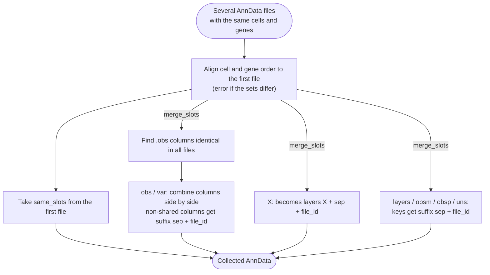

# Collect



*Conceptual overview of the main steps of the module. See the [functional description](#functional-description) below for details.*

```{include} ../../workflow/collect/README.md
:heading-offset: 1
```

## Functional description

### Inputs

* **File formats:** several `.h5ad` and/or `.zarr` files per task, configured under `input: collect:` (see {ref}`architecture`). All files must describe the **same cells and genes** (identical `obs_names`/`var_names` sets; order may differ). The first file is the reference for ordering.
* **Config keys** (defaults as implemented in the Snakefile): `same_slots` (`[]`), `merge_slots` (`[]`), `skip_slots` (`[]`), `sep` (`'_'`), `obs_index_col` (`{}`; string = same column for all files, or dict whose keys are regular expressions matched with `re.fullmatch` against file ids). `dask`/`backed` are accepted but not used by the script (files are always opened with `dask=True, backed=True`).
* Only slots listed in `same_slots` or `merge_slots` and not in `skip_slots` are read. For `.zarr` inputs, `X`, `raw`, `layers`, `obsm` and `obsp` are never loaded: `layers`/`obsm`/`obsp` are replaced by empty sparse placeholders that only carry the key names (they are later symlinked). For `.h5ad` inputs the data are loaded.

### Processing steps

1. **`collect_collect`** (script `collect.py`, helpers in `collect_utils.py`, environment `scanpy`). One job per task.
   ```text
   if one input file: write it unchanged (zarr: fully linked) and stop
   read all files (see Inputs)
   align_file_indices: for every file != first
       if obs_names/var_names differ only in order: reload large merge slots and reorder
           to the first file; such files are recorded and their slots are written as copies
       if the sets differ: raise ValueError
   if 'obs' in merge_slots:
       set obs index from obs_index_col for files that have a matching entry
       same_columns = obs columns present in all files with identical values
                      (numeric: np.array_equal(equal_nan=True), else Series.equals)
   for each file_id, for each slot in merge_slots:
       DataFrame (obs/var): concat columns side by side; columns not in same_columns
                            are renamed to <column><sep><file_id>; indices must match
       X:                   becomes layers['X<sep><file_id>']
       dict-like (layers/obsm/obsp/uns):
                            every key is renamed to <key><sep><file_id>
       for zarr files that need no reordering, X/dict entries are symlinked to the source
       file instead of being copied
   create AnnData from merged slots, compute dask layers
   write_zarr_linked(in_dir = first .zarr input, files_to_keep = merge_slots + skip_slots)
       -> all other top-level slots (including same_slots) are symlinked from that file
   symlink the per-file entries (e.g. obsm/X_pca<sep>file_1 -> <file_1>/obsm/X_pca)
   ```
   If none of the inputs is a `.zarr`, `same_slots` are taken from the AnnData object of the last file in the loop and written as copies. Slots in `skip_slots` are neither written nor linked.

### Outputs

Relative to `<output_dir>/collect/`:

* `dataset~<dataset>.zarr` — collected AnnData with
  * `.obs` (if merged): shared identical columns unchanged, all others suffixed `<sep><file_id>`,
  * `.layers['X<sep><file_id>']` if `X` is in `merge_slots`,
  * `.obsm`/`.obsp`/`.layers`/`.uns` keys suffixed `<sep><file_id>` for merged dict-like slots,
  * all remaining slots linked from the first `.zarr` input.

The suffix convention is reversed by the [uncollect](uncollect.md) module.

### Environments

* `scanpy`
