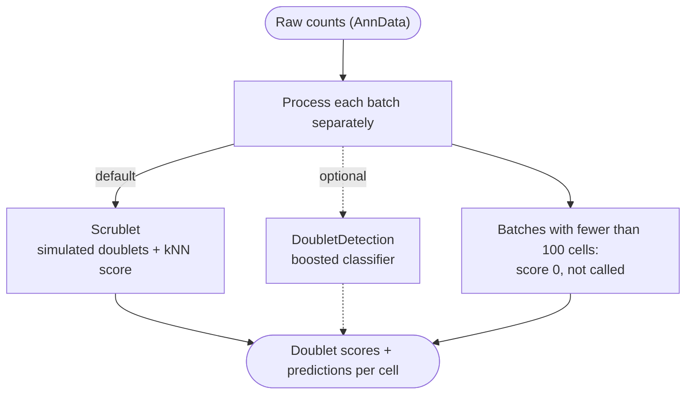

# Doublet Detection



*Conceptual overview of the main steps of the module. See the [functional description](#functional-description) below for details.*

```{include} ../../workflow/doublets/README.md
:heading-offset: 1
```

## Functional description

### Inputs

- One AnnData file per `file_id` (`.zarr` or `.h5ad`), resolved from `input: doublets:` (see {ref}`architecture`).
- Slots read:
  - the count matrix selected by `counts` (default `X`, e.g. `layers/counts` or `raw/X`); it should contain raw counts,
  - `obs`, in particular the batch column given by `batch` (internally `batch_key`).
- Further config keys (see Configuration above): `chunk_size` (default `100_000`), `methods` (default `['scrublet']`),
  `use_gpu` (default `false`).

### Processing steps

1. **`doublets_split_batches`** (Snakemake checkpoint, script `scripts/split_batches.py`, environment `scanpy`):
   reads `obs` only and groups batches into chunks so that the number of downstream jobs stays manageable.

   ```text
   if batch_key is None or 'None':
       write _batches/no_batch.txt                        # single dummy group
   else:
       counts = obs[batch_key].value_counts(sort=False, dropna=True)
       groups = []; current = []; n = 0
       for batch, count in counts:                        # greedy, in order of appearance
           if n + count > chunk_size and current:
               groups.append(current); current = [batch]; n = count
           else:
               current.append(batch); n += count
       groups.append(current)
       for i, group in enumerate(groups, 1):
           write _batches/group_{i}.txt                    # one batch name per line
   ```

   A group holds at most `chunk_size` cells unless a single batch is larger than `chunk_size`.
   Cells with a missing batch value (`NaN`) are not assigned to any group.
   After the checkpoint has run, Snakemake creates one job per group file for each requested method.

2. **`doublets_scrublet`** (script `scripts/scrublet.py`, environment `qc`, or `rapids_singlecell` if `use_gpu` is
   set for the task and the global `use_gpu: true`), one job per batch group. The job requests resources from the `gpu`
   profile.
   - Reads the `counts` slot as `X` plus `obs` (dask, backed), subsets to the cells of the batches in the group and
     loads them into memory.
   - For each batch in the group (cells selected with `obs[batch_key].astype(str) == batch`):
     - if the batch has fewer than 100 cells: `scrublet_score = 0`, `scrublet_prediction = 0`;
     - otherwise `pp.scrublet(adata, batch_key=None, sim_doublet_ratio=2.0, expected_doublet_rate=0.05,
       stdev_doublet_rate=0.02, synthetic_doublet_umi_subsampling=1.0, knn_dist_metric='euclidean',
       normalize_variance=True, log_transform=False, mean_center=True, n_prin_comps=min(30, n_obs-1, n_vars-1),
       use_approx_neighbors=True, threshold=None, random_state=0)`.
       If a GPU is detected, `rapids_singlecell.pp.scrublet` is used on GPU data; if it raises an error, the
       batch is moved back to CPU and rerun with `scanpy.pp.scrublet`. Without a GPU, `scanpy.pp.scrublet` is used.
     - `obs['doublet_score']` and `obs['predicted_doublet']` are renamed to `scrublet_score` and `scrublet_prediction`.
   - The per-batch tables are concatenated and written as a TSV indexed by cell barcode.
3. **`doublets_doubletdetection`** (script `scripts/doubletdetection.py`, environment `qc`, 3 threads, `cpu`
   resource profile), one job per batch group. It runs only if `doubletdetection` is listed in `methods`.
   - Reads the data and loops over batches as for scrublet, with the same skip rule for batches of fewer than 100 cells.
   - Per batch: `doubletdetection.BoostClassifier(n_iters=10, n_top_var_genes=4000,
     n_components=min(n_obs, n_vars, 30), clustering_algorithm='leiden',
     clustering_kwargs=dict(flavor='igraph', n_iterations=2), n_jobs=threads)`, then
     `clf.fit(X).predict(p_thresh=1e-16, voter_thresh=0.5)` gives `doubletdetection_prediction` and
     `clf.doublet_score()` gives `doubletdetection_score`.
4. **`doublets_collect`** (script `scripts/collect.py`, environment `scanpy`, local rule): collects the TSVs of all batch
   groups for each method listed in `methods`.
   - `.zarr` input: reads `obs` only. `.h5ad` input: reads all slots, with `X` taken from the `counts` slot.
   - Concatenates the per-group TSVs and left-joins them onto `obs` by cell barcode. `scrublet_prediction` is cast to
     string (`'True'`/`'False'`, or `'0'` for skipped batches). Cells that are not in any group, such as cells with a
     missing batch value, get `NaN`.
   - If the input has 0 cells, the result columns are added as empty (`NA`) columns.
   - Written with `write_zarr_linked(..., files_to_keep=['obs'], slot_map={'X': counts})`: in the output, `X` is linked
     to the input's `counts` slot.

### Outputs

- `<output_dir>/doublets/scatter/dataset~{dataset}/file_id~{file_id}/_batches/{group}.txt`: batch groups
  (`group_<i>` or `no_batch`).
- `<output_dir>/doublets/scatter/dataset~{dataset}/file_id~{file_id}/{scrublet,doubletdetection}/{group}.tsv`:
  per-cell scores and predictions for each batch group.
- `<output_dir>/doublets/dataset~{dataset}/file_id~{file_id}.zarr`: AnnData with
  `obs[['scrublet_score', 'scrublet_prediction']]` and/or `obs[['doubletdetection_score', 'doubletdetection_prediction']]`.
  `X` points to the counts slot of the input, and all other slots are linked to the input.

### Environments

- `scanpy`: `split_batches`, `collect`
- `qc`: `scrublet` (CPU) and `doubletdetection`
- `rapids_singlecell`: `scrublet` on GPU. It is only used when both the global `use_gpu: true` and the task-level
  `use_gpu: true` are set.
