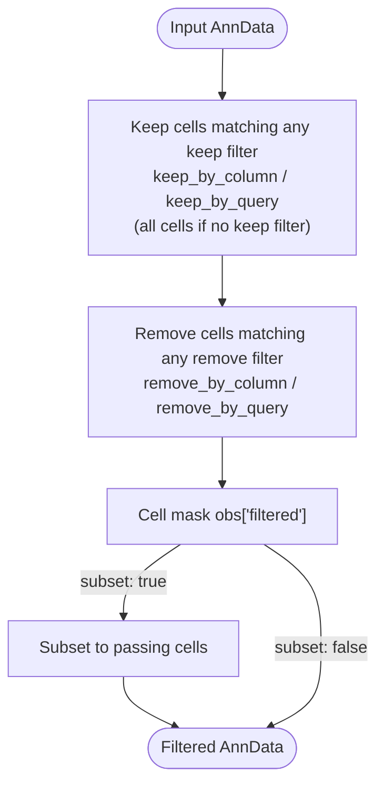

# Filter



*Conceptual overview of the main steps of the module. See the [functional description](#functional-description) below for details.*

```{include} ../../workflow/filter/README.md
:heading-offset: 1
```

## Functional description

### Inputs

- One AnnData file per `file_id` (`.zarr` or `.h5ad`), resolved from `input: filter:` (see {ref}`architecture`).
- Only `obs` is used to build the filter mask; all other slots are passed through (linked, or copied/subset when subsetting).
  The file is opened with `read_anndata(..., dask=True, backed=True)`, so matrices are not loaded into memory unless a copy is written.
- Config keys (per task, see Configuration above) and the defaults applied in the Snakefile:
  `subset` (default `true`), `write_copy` (default `false`; forced to `true` if the input is `.h5ad`),
  `keep_by_column` (default `{}`), `keep_by_query` (default `[]`), `remove_by_column` (default `{}`),
  `remove_by_query` (default `[]`).
  The key `dask` is accepted in the config but not used by the script.

### Processing steps

1. **`filter_filter`** (script `scripts/filter.py`, environment `scanpy`), one job per `dataset` × `file_id`:

   ```text
   has_keep = keep_by_column or keep_by_query
   mask = all False if has_keep else all True           # one entry per cell
   for column, values in keep_by_column:                # OR over all keep filters
       mask |= obs[column].astype(str).isin(str(v) for v in values)
   for query in keep_by_query:
       mask |= obs.eval(query)
   for column, values in remove_by_column:              # AND NOT over all remove filters
       mask &= ~obs[column].astype(str).isin(str(v) for v in values)
   for query in remove_by_query:
       mask &= ~obs.eval(query)
   obs['filtered'] = mask
   subset = subset and (at least one cell has mask == False)
   ```

   - Column filters compare string representations (`astype(str)`), so e.g. `true` in the config matches the boolean `True`
     in `obs`, and numeric values match their string form.
   - Query filters are evaluated with `pandas.DataFrame.eval` on `obs` and must return a boolean per cell.
   - Keep filters are applied before remove filters, so a cell matching both a keep and a remove filter is removed.
   - If no cell is removed, the subsetting step is skipped even when `subset: true`.
   - Writing:
     - `subset` false (or nothing removed): `write_zarr_linked(..., files_to_keep=['obs'])`: only `obs` (with the new
       `filtered` column) is written, all other slots are linked to the input.
     - `subset` true and `write_copy` true (or `.h5ad` input): `adata[obs['filtered']].copy()` is written as a full zarr
       copy (`write_zarr(..., compute=True)`).
     - `subset` true and `write_copy` false: only the subset `obs` is written. The other slots are linked to the input
       zarr together with the cell mask (`subset_mask=(mask, None)`), which `read_anndata` applies when the file is read.

### Outputs

- `<output_dir>/filter/dataset~{dataset}/file_id~{file_id}.zarr`: AnnData with `obs['filtered']` (bool, `True` = cell
  passed all filters). If subsetting was applied, the object only contains the cells with `filtered == True`.

### Environments

- `scanpy`
