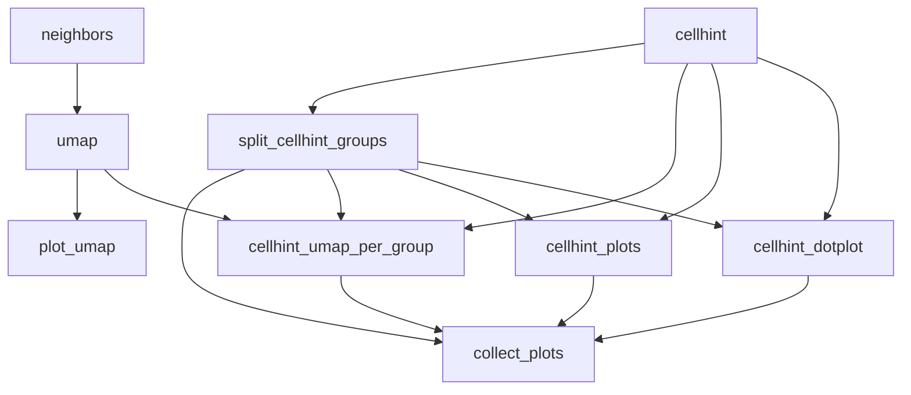

# Label Harmonization



*Rule graph of the `label_harmonization` module with all steps enabled, generated with `snakemake --rulegraph`. Grey rounded nodes are upstream modules; rule names correspond to the processing steps described below.*

```{include} ../../workflow/label_harmonization/README.md
:heading-offset: 1
```

## Functional description

### Inputs

* **File formats:** `.h5ad` or `.zarr` (AnnData), configured under `input: label_harmonization:` (see {ref}`architecture`).
* **`.obs`:** `dataset_key` (dataset of origin) and `author_label_key` (labels to harmonise); both are required.
* **`.obsm[use_rep]`:** representation for CellHint, from `cellhint.use_rep` (default `X_pca`; `null` is treated as `X_pca`).
* **`.X`:** read when `cellhint.use_pct: true` or the input is `.h5ad`. Used for PCT, for PCA if `X_pca` is missing, and for marker dot plots. If `.var['feature_name']` exists it is used as gene names for dot plots.
* **`.var['highly_variable']`:** boolean HVG mask used to subset genes before scaling/PCA (no subsetting if all genes are marked).
* **`.uns['preprocessing']['scaled']`:** if `true`, scaling for PCT is skipped unless `force_scale: true`.
* **`.obsm['X_umap']`:** for UMAP plots, unless recomputed (`recompute_umap` / `recompute_neighbors`).
* **Marker genes:** `marker_genes` resolved from top-level `MARKER_GENES` and flattened to a single `{label: [genes]}` mapping (or list).

### Processing steps

1. **`label_harmonization_cellhint`** (script `scripts/cellhint.py`, environment `cellhint`).
   ```text
   read obs, var, uns, obsm (+ X if use_pct or .h5ad), lazily with dask
   if subsample: keep a random fraction (0 < subsample < 1) of cells (numpy.random.choice, no replacement)
   if use_pct and (force_scale or not uns.preprocessing.scaled):
       subset to highly_variable genes; scanpy.pp.scale(max_value=10)
   if use_rep == "X_pca" and missing: subset to HVGs (if not yet), scanpy.pp.pca(use_highly_variable=True)
   alignment = cellhint.harmonize(adata, dataset=dataset_key, cell_type=author_label_key,
                                  reannotate=True, **cellhint)   # e.g. use_rep, use_pct
   ```
   `cellhint.harmonize` computes a cross-dataset cell type distance matrix (on `use_rep`, or with a predictive clustering tree when `use_pct: true`) and aligns labels into a harmonisation tree (`relation`), from which each cell gets a `reannotation` and a harmonised `group`. Outputs: the pickled `DistanceAlignment` model, `alignment.reannotation` with an added integer-string `reannotation_index` (TSV), `alignment.relation` with an added `group` column (TSV), and `.obs` columns `reannotation_index`, `reannotation`, `group` (for zarr inputs added to the full `.obs`; cells dropped by subsampling get NaN).

2. **`label_harmonization_neighbors`** / **`label_harmonization_umap`** (preprocessing scripts `neighbors.py`/`umap.py`, environment `scanpy` or `rapids_singlecell` with global `use_gpu`). Only for plotting. `recompute_neighbors: true` computes `scanpy.pp.neighbors(use_rep=cellhint.use_rep or X_pca)` followed by UMAP; `recompute_umap: true` recomputes UMAP on the existing graph (see the clustering module for details of these rules).

3. **`label_harmonization_split_cellhint_groups`** (checkpoint, script `scripts/split_cellhint_groups.py`, environment `scanpy`). Writes one empty `<group>.yaml` per unique non-NaN CellHint `group` plus `all.yaml`; the files define the `group` wildcard for all following per-group rules.

4. **`label_harmonization_cellhint_plots`** (script `scripts/cellhint_plots.py`, environment `cellhint`). Loads the alignment (`cellhint.DistanceAlignment.load`). For `group=all` uses the full relation and meta-level distance matrix (`alignment.base_distance.to_meta()`); otherwise subsets both to the `dataset: cell_type` labels of that group. Draws a `seaborn.clustermap` heatmap of the distance matrix (empty figure if ≤1 label) and `cellhint.treeplot` with `order_dataset=False` and `True` (empty figures on error).

5. **`label_harmonization_cellhint_umap_per_group`** (script `scripts/cellhint_umap.py`, environment `scanpy`). Adds `group`/`reannotation` from the reannotation TSV to the UMAP object and shuffles cells. For `group=all`: UMAPs coloured by `group`, `reannotation`, `dataset_key`, and one per dataset highlighting that dataset's author labels. For a single group: cells outside the group are masked (NaN) and UMAPs coloured by `reannotation` and `author_label_key` are drawn.

6. **`label_harmonization_cellhint_dotplot`** (script `scripts/dotplot.py`, environment `cellhint`). Filters marker genes to those present (asserts at least one). For `group=all`: `scanpy.pl.dotplot(groupby='group', use_raw=False, standard_scale='var')`. For a single group: cells of the group are grouped by `author_label_key`, plus a `rest` category of randomly sampled cells from other groups (sample size = min(#in-group, #rest)); an empty figure is saved if the group has no cells.

7. **`label_harmonization_collect_plots`** (local) touches `plots.done` once steps 4–6 exist for every group.

8. **`label_harmonization_plot_umap`** (preprocessing script `plot.py`, environment `scanpy`). UMAP of the (possibly recomputed) embedding file coloured by `plot_colors`. It additionally requests the colours `groups` and `reannotation`; these are not columns of the UMAP input and are therefore skipped by the plotting script (CellHint group UMAPs come from step 5).

### Outputs

Relative to `<output_dir>/label_harmonization/dataset~<dataset>/file_id~<file_id>/`:

* `cellhint/adata.zarr` — `.obs` with `reannotation_index`, `reannotation`, `group` (other slots linked to the input).
* `cellhint/reannotation.tsv` — per-cell `dataset`, `cell_type`, `reannotation`, `group`, `reannotation_index`.
* `cellhint/model.pkl` — CellHint `DistanceAlignment` object.
* `cellhint/groups/<group>.yaml` — checkpoint files; `cellhint/plots.done` — completion flag.
* `neighbors.zarr`, `umap.zarr` — only when recomputation is requested.

Relative to `<images>/label_harmonization/dataset~<dataset>/file_id~<file_id>/`:

* `cellhint/relation.tsv` — harmonisation relation table with `group` column.
* `cellhint/group~<group>/treeplot.png`, `treeplot_ordered.png`, `heatmap.png`, `dotplot.png`, `umaps/*.png` (`group` is a CellHint group or `all`).
* `umaps/<color>.png` — UMAPs coloured by `plot_colors`.

### Environments

* `cellhint` — harmonisation, tree plots/heatmaps, dot plots.
* `scanpy` — group splitting, UMAP plots.
* `rapids_singlecell` — neighbours/UMAP recomputation when the global `use_gpu: true`.
