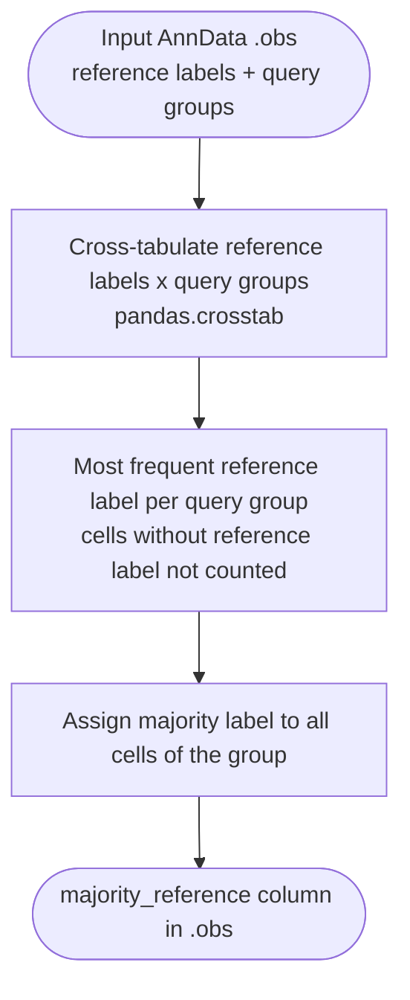

# Label Transfer



*Conceptual overview of the main steps of the module. See the [functional description](#functional-description) below for details.*

```{include} ../../workflow/label_transfer/README.md
:heading-offset: 1
```

## Functional description

This module currently implements one label transfer strategy, *majority reference*: every cluster (or other grouping) of the query annotation inherits the most frequent reference label among its cells. It differs from the {doc}`majority_voting` module, which computes a per-cell consensus across several label columns rather than a per-cluster majority of one label column.

### Inputs

* **File formats:** `.h5ad` or `.zarr` (AnnData), configured under `input: label_transfer:` (see {ref}`architecture`). Only `.obs` is read.
* **`.obs[majority_reference.reference_key]`:** labels to transfer (e.g. reference cell types; cells without a label may be NaN).
* **`.obs[majority_reference.query_key]`:** grouping that receives labels (e.g. clusters spanning reference and query cells).
* **`majority_reference.crosstab_kwargs`** (optional, default `{}`): keyword arguments for `pandas.crosstab` (e.g. `dropna: false`).
* `majority_consensus` is accepted as a config key but not used by any rule.

### Processing steps

1. **`label_transfer_majority_voting`** (script `scripts/majority_voting.py`, environment `scanpy`).
   ```text
   ref = obs[reference_key].astype(str), with "nan" restored to NaN
   table = pandas.crosstab(ref, obs[query_key], **crosstab_kwargs)   # reference labels x query groups
   majority = table.idxmax(axis=0)          # most frequent reference label per query group
   obs["majority_reference"] = Categorical(obs[query_key].map(majority),
                                           categories=unique non-NaN majority labels)
   ```
   Cells with a missing reference label are not counted. Ties are resolved by `idxmax` (first label in the crosstab's sorted row order). Every cell of a query group, including those with their own reference label, receives the group's majority label.

### Outputs

* `<output_dir>/label_transfer/dataset~<dataset>/file_id~<file_id>.zarr` — `.obs` with the new categorical column `majority_reference` (the reference column is stored as string/NaN); all other slots are linked to the input.

### Environments

* `scanpy` — the only environment used.
