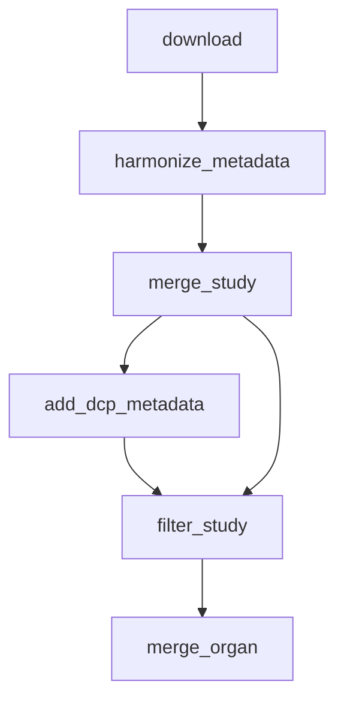

# Data loading



*Rule graph of the `load_data` module with all steps enabled, generated with `snakemake --rulegraph`. Grey rounded nodes are upstream modules; rule names correspond to the processing steps described below.*

```{include} ../../workflow/load_data/README.md
:heading-offset: 1
```

## Functional description

Unlike the other modules, `load_data` is not configured under `DATASETS`; it is driven by a dataset table and global config keys (see *Preparing the input data* above). Rule names below are given with the module prefix; rules that the module itself defines via `use rule ... as load_data_<x>` receive a second prefix in the full pipeline (e.g. `load_data_load_data_merge_study`).

### Inputs

* **`dataset_meta`** — TSV read by `utils/data.py::load_dataset_df` (lines starting with `#` are ignored, `url` is cast to string, `subset` is split on `,` and exploded so that a dataset can belong to several subsets). Alternatively an in-memory `dataset_df` can be passed in the config. Columns used by the code: `dataset`, `study`, `organ`, `subset`, `url`, `collection_id`, `dataset_id`, `project_uuid`, `schema`, `donor_column`, `tech_id`, `author_annotation`, optional `annotation_file`, `barcode_column`, `keep_covariates`. All other columns are passed through as metadata.
* **`schema_file`** — TSV with one column per schema name (e.g. `cellxgene`, `custom`, `dcp`); rows with any missing value are dropped before use.
* **`dcp_metadata`** (optional) — TSV with columns `study`, `filename`; each `filename` is a DCP metadata TSV.
* **`filter_per_organ`**, **`filter_per_study`** (optional) — per-study filter settings; for each study, every top-level key of its organ's settings is used unless the study defines the same key (keys are replaced, not merged). Only `remove_by_column` is passed to the filter step.
* **Data files:** `.h5ad` (or `.loom` from DCP) with counts in `.X` or `.raw.X`.

### Processing steps

1. **`load_data_download`** (script `scripts/download.py`, environment `scanpy`). Only scheduled for datasets whose `url` is not an existing file. The download location is resolved by `scripts/load_data_utils.py::get_url`:
   * `url` ∈ {`cellxgene`, `CELLxGENE`, `CxG`, `cxg`}: query the CELLxGENE curation API `api.cellxgene.cziscience.com/curation/v1/collections/<collection_id>/datasets/<dataset_id>/` and take the URL of the `H5AD` asset;
   * `url` ∈ {`dcp`, `DCP`, `hca`, `HCA`, `HCA DCP`, `hca dcp`}: query the HCA Azul service `service.azul.data.humancellatlas.org/index/projects/<project_uuid>` (catalog `dcp25`) and take the project matrix URL and its format;
   * otherwise `url` is used directly; an empty/`nan` value raises an error.

   The file is fetched with `wget` into the job's `tmpdir`; `.h5ad` files are copied to the output, `.loom` files are read with `scanpy.read_loom(sparse=True)` and written as h5ad (`compression='lzf'`).
2. **`load_data_harmonize_metadata`** (script `scripts/harmonize_metadata.py`, environment `scanpy`, 5 threads). One job per dataset; `meta` = the dataset's row of the dataset table (without `subset`).
   ```text
   adata = read_anndata(file, dask=True, backed=True, stride=500000), X/layers made sparse
           (fallback: scanpy.read_loom)
   uns: keep only 'schema_version' and 'batch_condition'
   if adata.raw: X = raw.X; delete raw                          # counts in X
   uns['meta'] = meta; obs/uns['organ'|'study'|'dataset'] = meta values
   if annotation_file: read CSV, drop duplicate barcode_column rows, index by barcode_column,
       copy every column to obs by index (columns that are entirely NaN after mapping are dropped)
   obs['donor'] = obs[meta.donor_column]
   obs['tech_id'] = '-'.join(obs[c] for c in meta.tech_id.split('+')); obs['sample'] = obs['tech_id']
   obs['batch_condition'] = '-'.join(obs[uns['batch_condition']]) if present else meta.study
   schema_version defaults to '0.0.0'; for '2.0.0': copy ethnicity(_ontology_term_id) to
       self_reported_ethnicity(_ontology_term_id) and donor to donor_id
   obs['author_annotation'] = obs[meta.author_annotation]
   if obs['cell_type'] missing or constant: obs['cell_type'] = author_annotation
   every remaining scalar meta entry becomes a constant obs column
   obs['barcode'] = obs_names if not present
   obs_names = barcode + '-' + tech_id
   rename obs columns from schema meta.schema to 'cellxgene' via schema_file
   keep only CELLxGENE_OBS ∪ TIER1 ∪ EXTRA_COLUMNS (∪ keep_covariates.split(',')) columns,
       adding missing ones as NaN                                 # lists in load_data_utils.SCHEMAS
   var: feature_name = var_names if missing; keep only feature_name, feature_reference,
       feature_biotype (missing ones as NaN); index name 'feature_id'
   write_zarr (dask arrays computed while writing)
   ```
3. **`load_data_merge_study`** (script `scripts/merge.py` of this module, environment `scanpy`, 5 threads). Merges all harmonised datasets of a study with `merge_strategy='inner'`, `keep_all_columns=True`, in memory:
   ```text
   if one file: symlink it and stop; drop empty files (if all empty: write empty AnnData)
   read X, obs, var, uns of each file; restrict var to CELLxGENE_VARS
       (and obs to CELLxGENE_OBS ∪ EXTRA_COLUMNS if not keep_all_columns)
   adata = sequential sc.concat(join=merge_strategy)       # dask: one sc.concat; backed: AnnCollection
   var = pandas.merge of all var tables on feature_id + CELLxGENE_VARS (how=merge_strategy),
         de-duplicated; adata subset to these genes
   assert a single organ
   uns['dataset'] = study, uns['organ'], uns['meta'] = {dataset, organ, per_dataset: {dataset: meta}}
   ```
4. **`load_data_add_dcp_metadata`** (script `scripts/add_dcp_metadata.py`, environment `scanpy`, 10 GB). Only for studies listed in both `dcp_metadata` and the dataset table.
   ```text
   for each DCP id column (donor/specimen/sample/cell line/organoid ids, donor_id) present in the DCP TSV,
       and for each obs column in {donor_id, sample}:
       split DCP values on ' || ', count overlap with obs values
   choose the (DCP column, obs column) pair with the largest overlap
   if overlap > 0:
       keep DCP columns starting with the id column or with any of analysis_process,
         biomaterial_core, cell_suspension, collection_protocol, donor_organism,
         enrichment_protocol, library_preparation_protocol, process, protocol,
         sequencing_protocol, specimen_from_organism
       explode ' || ' lists, drop duplicates; cast mixed str/bool columns to str, drop all-null columns
       left-join onto obs, keep the first match per cell (cell count is asserted unchanged)
   write obs (other slots linked); write best-match statistics incl. mismatched IDs to stats.tsv
   ```
5. **`load_data_plot_stats`** (script `scripts/plot_stats.py`, environment `plots`; target `dcp_metadata_all`). Concatenates the per-study `stats.tsv`, writes `id_intersection.tsv` and a horizontal bar plot of `intersection_fraction` (overlap / number of distinct obs IDs) per study.
6. **`load_data_filter_study`** (filter module script `filter/scripts/filter.py`, environment `scanpy`). Input: the DCP-annotated study if available, otherwise the merged study. Called with `remove_by_column` from `filter_per_study[study]`, `dask=True`, `backed=False` and **`subset=False`**: cells whose `obs[column]` (as string) is in the listed values get `obs['filtered'] = False`, all others `True`; no cells are removed and only `.obs` is rewritten (other slots linked).
7. **`load_data_merge_organ`** (same merge script; default target `all`). Merges the filtered studies of an organ with `merge_strategy='inner'`, `dask=True` (Dask workers = number of datasets × 3), `keep_all_columns` unset (`False`) — so `.obs` is reduced to `CELLxGENE_OBS ∪ EXTRA_COLUMNS` (TIER1 and `keep_covariates` columns are dropped, and so is `obs['filtered']` from step 6, since it is not in these lists). Memory: 3× the `cpu` profile.
8. **`load_data_merge_subset`** (same merge script; target `merge_subset_all`). As step 7, but per `organ` × `subset` value of the dataset table (`dask=True`).

`load_data_merge_organ_filter` refers to an output `removed` of the filter rule that the filter step does not define; it is not part of any default target.

### Outputs

Relative to `<output_dir>/load_data/`:

* `download/<dataset>.h5ad` — downloaded raw file.
* `harmonize_metadata/<dataset>.zarr` — harmonised dataset (X = counts; obs/var as above; `uns['meta']`, `uns['organ'|'study'|'dataset']`, `uns['schema_version']`).
* `merged/study/<study>.zarr`, `dcp_metadata/<study>.zarr` (+ `dcp_metadata/<study>/stats.tsv`, `dcp_metadata/id_intersection.tsv`).
* `filtered/<study>.zarr` — study with `.obs['filtered']`.
* `merged/organ/<organ>.zarr` — final organ-level object (default target); `merged/subset/<organ>-<subset>.zarr`.

Images: `<images>/load_data/dcp_metadata/id_intersection.png`.

### Environments

* `scanpy` — all data processing steps.
* `plots` — DCP statistics plot.
* `envs/awscli.yaml` and `envs/gdrive.yaml` in the module directory are not referenced by any rule.
