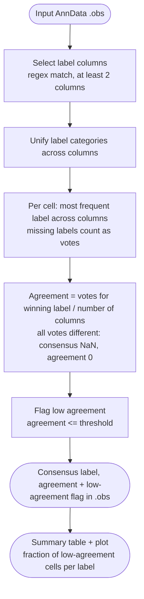

# Majority Voting



*Conceptual overview of the main steps of the module. See the [functional description](#functional-description) below for details.*

## Module description

```{include} ../../workflow/majority_voting/README.md
:heading-offset: 1
:start-line: 1
```

## Functional description

### Inputs

* **File formats:** `.h5ad` or `.zarr` (AnnData), configured under `input: majority_voting:` (see {ref}`architecture`). Only `.obs` is read.
* **`.obs` label columns:** selected by `columns`, a list of regular expressions matched with `re.fullmatch` against all `.obs` column names (order of `.obs`, duplicates removed). At least two matching columns are required, otherwise the job fails.
* **`threshold`:** agreement threshold for flagging low consensus. The rule passes the configured value without a default, so it must be set in the config (the script's fallback of `0.5` only applies when the parameter is absent).

### Processing steps

1. **`majority_voting_majority_voting`** (script `scripts/majority_voting.py`, environment `scanpy`).
   ```text
   columns = [c for c in obs.columns if any(re.fullmatch(p, c) for p in column_patterns)]
   assert len(columns) >= 2
   convert each column to categorical; warn if category sets differ between columns
   categories = union of all columns' categories
   codes = obs[columns] recoded to the shared categories (NaN -> -1)
   for each cell: mode = most frequent code (ties -> smallest code, i.e. NaN, then
                  alphabetically first category); count = frequency of the mode
   majority_consensus           = category of mode (NaN if mode is NaN)
   majority_consensus_agreement = count / n_columns
   if agreement <= 1 / n_columns:           # every vote different
       majority_consensus = NaN; agreement = 0
   majority_consensus_low_agreement = agreement <= threshold
   ```
   Missing labels count as votes for "NaN", so they lower the agreement of the other labels and can win the vote.
2. Summary statistics: counts of cells per (`majority_consensus`, `majority_consensus_agreement`) combination, with the total and fraction of cells per consensus label, written as TSV.
3. Plot: `pandas.crosstab(majority_consensus, majority_consensus_low_agreement, normalize='index')` drawn as a horizontal stacked bar chart (sorted by fraction of low-agreement cells).

### Outputs

* `<output_dir>/majority_voting/dataset~<dataset>/file_id~<file_id>.zarr` — `.obs` with added `majority_consensus` (categorical), `majority_consensus_agreement` (float in [0, 1]) and `majority_consensus_low_agreement` (bool); input label columns are converted to categorical. All other slots are linked to the input.
* `<images>/majority_voting/dataset~<dataset>/file_id~<file_id>/majority_consensus_agreement.tsv` — columns `majority_consensus`, `majority_consensus_agreement`, `count`, `total_cells_majority_consensus_label`, `frac_cells_in_majority_consensus_label`.
* `<images>/majority_voting/dataset~<dataset>/file_id~<file_id>/majority_consensus_frac.png` — fraction of low-agreement cells per consensus label.

### Environments

* `scanpy` — the only environment used.
