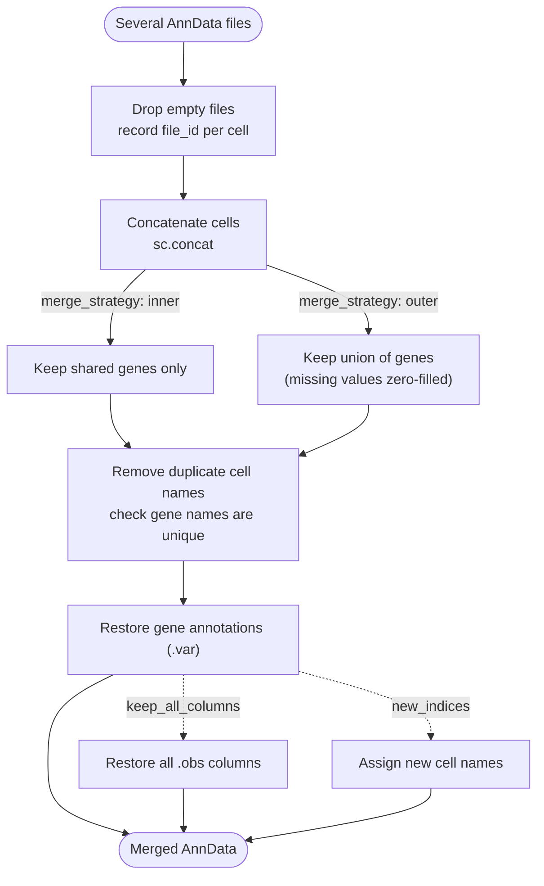

# Merge



*Conceptual overview of the main steps of the module. See the [functional description](#functional-description) below for details.*

```{include} ../../workflow/merge/README.md
:heading-offset: 1
```

## Functional description

### Inputs

* **File formats:** any number of `.h5ad` or `.zarr` AnnData files per task, configured under `input: merge:` (see {ref}`architecture`). All input files of one task are merged into one output; the file ids of the inputs become the values of `.obs['file_id']`.
* **Slots:** by default all slots are read (`utils/io.py::read_anndata`). `slots` (default `{}`) maps AnnData slot names to zarr group names, e.g. `{X: layers/counts}`, and restricts/renames what is read. `slots['X']` (default `X`) is also used to look up the shape of each zarr input.
* **Config keys** (see Configuration above) with defaults as implemented in the Snakefile: `merge_strategy='inner'`, `keep_all_columns=false`, `dask=false`, `backed=false`, `persist=false`, `stride=100000`, `threads=1`, `allow_duplicate_obs=false`, `allow_duplicate_vars=false`, `new_indices=false`. The rule requests 3× the default `cpu` memory profile.

### Processing steps

1. **`merge_merge`** (script `merge.py`, environment `scanpy`). One job per task (wildcard `dataset`). Dask is configured with `num_workers = threads` and `array.slicing.split_large_chunks=False`.
   ```text
   if one input file: symlink it to the output (link_zarr) and stop
   shape[file] = n_obs/n_vars from <zarr>/<slots.X>/.zattrs (fallback: read obs+var)
   drop files with n_obs == 0; if none left: write an empty AnnData and stop
   for each file: adata_i = read_anndata(file, **slots); obs['file_id'] = file_id; ensure sparse X/layers
   if dask:                       # all files read with backed=True, dask=True, chunk stride=stride
       if persist and n_files > 2:
           group consecutive files into batches of >= stride cells
           concat each batch (sc.concat(join=merge_strategy)), .persist() X/raw/layers
           reduce batches pairwise ((0,1),(2,3),…, odd one carried) with concat + persist until one is left
       else:
           sc.concat(all, join=merge_strategy); persist once if persist
   elif backed:                   # slots mapping is not applied in this mode
       AnnCollection(adatas, join_obs='outer', join_obsm=None, join_vars=merge_strategy)[:].to_adata()
   else:                          # in memory
       adata = adata_1; for i >= 2: adata = sc.concat([adata, adata_i], join=merge_strategy)
   if not allow_duplicate_obs: drop cells whose obs_name occurred before (keep first)
   if not allow_duplicate_vars: assert var_names are unique
   for each input var table: copy its columns into merged .var for the shared genes
       (categoricals cast to str), then infer dtypes
   if keep_all_columns:
       outer-concat .obs of all inputs (dropping duplicate indices unless allowed),
       align to merged obs_names (error if cells are missing), obs = obs.combine_first(merged_obs)
   uns['merge'] = {files, file_ids, n_files, merge_strategy, allow_duplicate_obs,
                   allow_duplicate_vars, reindexed=new_indices, original_shapes}
   if new_indices: obs['obs_names_before_<dataset>'] = obs_names
                   obs_names = '<dataset>-' + 0..n_obs-1
   write_zarr (dask arrays are computed while writing)
   ```
   `join=merge_strategy` controls both the gene set (`inner`: intersection, `outer`: union with zero fill) and, because `sc.concat` is called without a `merge` argument, the `.obs` columns kept by default (`inner`: shared columns only, `outer`: all columns). `.var` annotation and, with `keep_all_columns`, `.obs` columns lost by the concatenation are restored afterwards. Slots that differ between files are handled by `anndata.concat` semantics (e.g. `.obsm` keys missing in one file are dropped for `inner`). `.uns` of the inputs is not carried over.

### Outputs

Relative to `<output_dir>/merge/`:

* `dataset~<dataset>.zarr` — merged AnnData with
  * `.obs['file_id']` — input file id of every cell,
  * `.obs['obs_names_before_<dataset>']` — only with `new_indices: true`,
  * `.var` — union of the per-file gene annotations for the retained genes,
  * `.uns['merge']` — provenance dictionary described above.

  With a single input file the output is a symlink to the input and none of the above annotations are added.

### Environments

* `scanpy`
