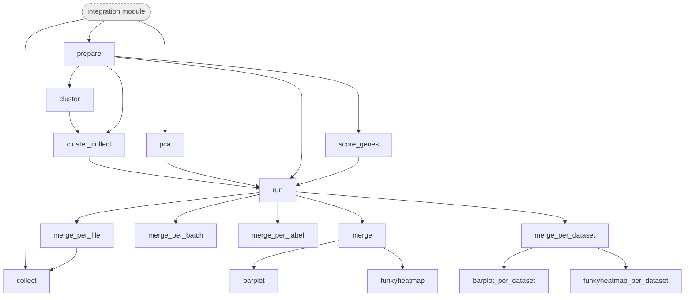

# Metrics



*Rule graph of the `metrics` module with all steps enabled, generated with `snakemake --rulegraph`. Grey rounded nodes are upstream modules; rule names correspond to the processing steps described below.*

```{include} ../../workflow/metrics/README.md
:heading-offset: 1
```

## Functional description

### Inputs

- One AnnData file per `file_id` (`.zarr` or `.h5ad`), typically the outputs of the `integration` module (see
  {ref}`architecture`).
- Representation type: `uns['output_type']` of the file if present, otherwise `output_type` from the config
  (default `embed`). It decides which slot holds the corrected representation:
  - `knn`: `obsp['connectivities']` and `obsp['distances']`, with `uns['neighbors']`;
  - `embed`: `obsm['X_emb']`;
  - `full`: the matrix selected by `corrected` (default `X`).
- Other slots and config keys, with the code defaults:
  - `obs[batch]` and `obs[label]`: `batch` and `label` may be lists; one job is created per combination.
  - `var[var_mask]`: feature mask (default `highly_variable`). `None` means all genes.
  - The unintegrated matrix selected by `unintegrated` (default `X`): used for PCA of the unintegrated data and for
    gene scoring.
  - `uns['wildcards']`: if present, its entries are added as columns to the results table.
  - `neighbors`: keyword arguments for `pp.neighbors` (default `{}`). `recompute_neighbors` (default `false`).
  - `pca`: keyword arguments for the unintegrated PCA (default `{mask_var: var_mask}`).
  - `clustering`: `kwargs`, `overwrite` (default `true`) and `precomputed_key`.
  - `covariates`: default `[label, batch]` for metrics that use covariates.
  - `gene_sets` (or `MARKER_GENES`), `gene_score` (`n_permutations`, default 20).
  - `parse_file_id` (default `false`). `funkyheatmap` (`group_col`, `weight_batch` default 0.4, `n_top` default 50,
    `scale` default `false`).
  - `raw_counts` is accepted, but no rule currently uses it. `gene_score: n_quantiles` is passed on but not used.
- `metrics` (legacy alias `methods`) lists the metrics to compute. Each name must be in `params.tsv`, otherwise the
  workflow stops with an assertion error. `params.tsv` sets, for each metric, `metric_type`, `allowed_output_types`,
  `input_type`, `comparison`, `needs_clustering`, `use_covariate`, `use_gene_set`, `env`, `resources` (`cpu`/`gpu`
  profile) and `threads` (see Metric parameters above).

### Metrics

In the table, *embedding* means `obsm['X_emb']` for `embed` outputs and `obsm['X_pca']` (PCA of the corrected
features) for `full` outputs. *kNN graph* means the integration's graph for `knn` outputs, and the graph computed in
`prepare` on the embedding for `embed`/`full` outputs. *Allowed* lists the output types the metric is computed for;
other output types get a `NaN` score.

| metric | what it measures (implementation) | metric_type | input used | allowed | env |
|---|---|---|---|---|---|
| `asw_batch` | batch ASW within labels (`scib.me.silhouette_batch`) | batch_correction | embedding | full, embed | scib |
| `graph_connectivity` | connectivity of each label's subgraph (`scib.me.graph_connectivity`) | batch_correction | kNN graph | all | scib |
| `ilisi` | graph iLISI, scaled (`scib.me.ilisi_graph(type_='knn', subsample=50)`) | batch_correction | kNN graph | all | scib |
| `pcr_comparison` | change in batch variance explained by PCs, before vs. after integration (`scib.me.pcr_comparison(covariate=batch, recompute_pca=False)`) | batch_correction | `X_pca` (PCA of the embedding for `embed`, PCA of the corrected features for `full`) vs. unintegrated `X_pca` | full, embed | scib |
| `ari` | ARI between label and the Leiden clustering with the highest NMI (`scib.me.ari`) | bio_conservation | Leiden clusters on kNN graph | all | scib |
| `nmi` | NMI between label and the Leiden clustering with the highest NMI (`scib.me.nmi`) | bio_conservation | Leiden clusters on kNN graph | all | scib |
| `asw_label` | label silhouette (`scib.me.silhouette`) | bio_conservation | embedding | full, embed | scib |
| `cell_cycle` | conservation of cell-cycle variance (`scib.me.cell_cycle(recompute_cc=False)`, with S/G2M scores from `scib.pp.score_cell_cycle` per batch on the unintegrated data) | bio_conservation | embedding + unintegrated features | full, embed | scib |
| `clisi` | graph cLISI, scaled (`scib.me.clisi_graph(type_='knn', subsample=50)`) | bio_conservation | kNN graph | all | scib |
| `isolated_label_asw` | ASW of isolated labels (`scib.me.isolated_labels_asw`) | bio_conservation | embedding | full, embed | scib |
| `isolated_label_f1` | F1 of isolated labels vs. clusters (`scib.me.isolated_labels_f1(cluster_key='leiden')`) | bio_conservation | Leiden clusters on kNN graph | all | scib |
| `kbet` | listed in `params.tsv` but not implemented in `scripts/metrics/__init__.py` | batch_correction | – | all | scib |
| `morans_i` | Moran's I of each covariate on the graph (`scanpy.metrics.morans_i`); for categorical covariates, the mean over ≤10 random integer encodings; clipped at 0 | bio_conservation | kNN graph + `obs[covariate]` | all | scanpy |
| `morans_i_genes` | mean Moran's I of the unintegrated expression of each gene in a gene set (`scanpy.metrics.morans_i`) | bio_conservation | kNN graph + unintegrated expression of gene-set genes | all | scanpy |
| `morans_i_random` | Moran's I of random normal values (negative baseline); 5 bootstraps on 90% of cells, with neighbors recomputed | batch_correction | kNN graph | all | scib |
| `morans_i_genescore` | Moran's I of each gene-set score (`scanpy.metrics.morans_i`) | bio_conservation | kNN graph + `obs['gene_score:<set>']` | all | scanpy |
| `ari_leiden_y` / `nmi_leiden_y` | ARI/NMI of Leiden clustering with optimised resolution (`scib_metrics.nmi_ari_cluster_labels_leiden(optimize_resolution=True)`) | bio_conservation | kNN graph | all | scib_metrics |
| `ari_kmeans_y` / `nmi_kmeans_y` | ARI/NMI of k-means clustering (`scib_metrics.nmi_ari_cluster_labels_kmeans`) | bio_conservation | kNN graph; dense connectivities as features for `nmi_kmeans_y` | all | scib_metrics |
| `asw_label_y` | label silhouette (`scib_metrics.silhouette_label`) | bio_conservation | embedding | full, embed | scib_metrics |
| `asw_batch_y` | batch silhouette (`scib_metrics.silhouette_batch`) | batch_correction | embedding | full, embed | scib_metrics |
| `bras_batch` | BRAS, batch-removal adapted silhouette (`scib_metrics.bras(metric='cosine', between_cluster_distances='mean_other')`) | batch_correction | embedding | full, embed | scib_metrics |
| `ilisi_y` / `clisi_y` | mean per-cell iLISI / cLISI (`scib_metrics.ilisi_knn` / `clisi_knn`) | batch_correction / bio_conservation | kNN graph | full, embed | scib_metrics |
| `isolated_label_asw_y` | isolated label score (`scib_metrics.isolated_labels`) | bio_conservation | embedding | full, embed | scib_metrics |
| `kbet_y` | kBET acceptance rate (`scib_metrics.kbet`) | batch_correction | kNN graph | all | scib_metrics |
| `kbet_pg` | mean kBET acceptance rate over labels (`pegasus.calc_kBET(attr=batch, rep='emb', K=50)` per label; labels present in only one batch are skipped) | batch_correction | `obsm['X_emb']` | full, embed | pegasus |
| `graph_connectivity_y` | graph connectivity (`scib_metrics.graph_connectivity`) | batch_correction | kNN graph | all | scib_metrics |
| `pcr_y` | PCR comparison for batch (`scib_metrics.pcr_comparison(categorical=True)`) | batch_correction | `X_emb` (or corrected `X`) vs. unintegrated HVG matrix | full, embed | scib_metrics |
| `pcr_random` | variance explained by PCs for a random normal covariate (`scib.metrics.pcr`), as a baseline | batch_correction | `X_pca` | full, embed | scib |
| `pcr` | variance explained by PCs for each covariate (`scib.metrics.pcr`); one score per covariate (`pcr:<cov>`) | bio_conservation | `X_pca` + `obs[covariate]` | full, embed | scib |
| `pcr_genes` | PCR for each gene-set score (`scib.metrics.pcr`), clipped at 0 (`pcr_genes:<set>`) | bio_conservation | `X_pca` + `obs['gene_score:<set>']` | full, embed | scib |
| `pcr_random_genes` | listed in `params.tsv` but not implemented in `scripts/metrics/__init__.py` | batch_correction | – | full, embed | scib |

`_y` variants are the [scib-metrics](https://github.com/YosefLab/scib-metrics) (JAX) re-implementations of the
[scib](https://github.com/theislab/scib) metrics. They run in the `scib_metrics` environment and request the `gpu`
resource profile. The kNN-based `_y` metrics convert the scanpy distance matrix into a
`scib_metrics.nearest_neighbors.NeighborsResults` with `n_neighbors` columns (`scanpy_to_neighborsresults`).
Labels and batches are integer-encoded. The non-default rule `metrics_compare_metrics` plots the runtime ratio and the
scores of scib vs. scib-metrics against each other.

### Processing steps

1. **`metrics_prepare`** (script `scripts/prepare.py`, environment `scanpy`, or `rapids_singlecell` with `use_gpu`):
   builds one representation per file that all metrics use.

   ```text
   output_type = uns['output_type'] or config output_type
   read obs, obsm, obsp, var, uns (+ X = corrected, as dask, if output_type == 'full')
   if input is .h5ad: also read X = corrected and layers; layers['unintegrated'] = unintegrated slot
   if var_mask is None: var['highly_variable'] = True  else assert var_mask in var
   force_neighbors = obsp lacks connectivities/distances or recompute_neighbors
   if output_type == 'full':
       sc.pp.pca(adata, mask_var=var_mask, svd_solver='covariance_eigh')   # on corrected X
       obsm['X_emb'] = obsm['X_pca']; force_neighbors = True
   elif output_type == 'embed':
       obsm['X_pca'] = PCA of obsm['X_emb'] (sc.tl.pca, variance stored in uns['pca'])
   compute_neighbors(adata, output_type, force=force_neighbors, **neighbors)
       knn:   keep the integrated graph (only checked; never recomputed)
       embed: pp.neighbors(use_rep='X_emb') if forced or missing
       full:  pp.neighbors(use_rep='X_emb')  (= PCA of corrected features)
   drop all obsm keys except X_pca and X_emb
   ```

   Writes `uns`, `var`, `obsm/X_pca` and, if the graph was recomputed, `obsp`. All other slots are linked to the input,
   with `X` linked to the `corrected` slot for `full` outputs. `.h5ad` inputs are written as a full copy.
2. **`metrics_pca`** (preprocessing `pca` rule, script `preprocessing/scripts/pca.py`, environment `scanpy`/`rapids_singlecell`):
   runs only for metrics with `comparison=True` (`pcr_comparison`, `cell_cycle`, `pcr_y`, `pcr_random`).
   It computes `pp.pca` on the `unintegrated` slot, subset to `var_mask` features (`subset=True`), with arguments from
   `pca`. The result is the unintegrated reference (`adata_raw`: HVG matrix and `obsm['X_pca']`).
3. **`metrics_cluster`** (clustering `cluster` rule, environment `scanpy`), only for metrics with `needs_clustering`
   (`nmi`, `ari`, `isolated_label_f1`) and only if `clustering.precomputed_key` is not set. It runs Leiden clustering
   (`algorithm=leiden`, `level=1`) on the prepared kNN graph at 10 resolutions, 0.2 to 2.0 in steps of 0.2, with
   `clustering.kwargs`. **`metrics_cluster_collect`** merges the results into `obs['leiden_<resolution>_1']` of
   `clustered.zarr`.
4. **`metrics_score_genes`** (script `scripts/score_genes.py`, environment `scanpy`/`rapids_singlecell`), only for
   metrics with `use_gene_set`:
   - reads the `unintegrated` slot as `X`, uses `var['feature_name']` as gene names if present, keeps only the genes of
     each gene set that are in the data, and removes duplicate gene names;
   - subsamples to at most 4M cells;
   - draws `n_permutations` random sets of 50 control genes from genes outside all gene sets and scores them with
     `tl.score_genes(ctrl_size=50)`, storing the result in `obsm['random_gene_scores']`;
   - scores each gene set with `tl.score_genes(score_name='gene_score:<set>', ctrl_size=50)`;
   - subsets the features to the gene-set genes and writes `obs` and `obsm`, with other slots linked through a
     cell/gene subset mask. If no gene-set gene is found, the input is written through unchanged.
5. **`metrics_run`** (script `scripts/run.py`, environment `env` from `params.tsv`, `threads` from `params.tsv`), one job
   per `dataset` × `file_id` × `label` × `batch` × `metric`. The input is `prepare.zarr`, replaced by `clustered.zarr` if
   clustering is needed or by `gene_scores.zarr` if gene sets are used. For `comparison` metrics, the unintegrated PCA
   is also read.

   ```text
   if output_type not in allowed_output_types: write score NaN and stop
   read obs, uns (+ obsp if 'knn' in input_type, obsm if 'embed', X+var if 'full')
   drop cells with missing batch;  (most metrics also drop cells with missing label)
   covariates = configured covariates or [label, batch]
   cluster columns = obs columns 'leiden*_1'  or  [clustering.precomputed_key]
   scores, names = metric_function(adata, output_type, batch_key, label_key, adata_raw,
                                   cluster_keys, covariate, gene_set, n_threads)
   write one row per (metric_name, score)
   ```

   Metrics that return several scores, such as the per-covariate, per-gene-set or bootstrapped metrics, produce several
   rows. A Snakemake benchmark (runtime and memory) is recorded for every job.
6. **`metrics_merge_per_file`**, **`metrics_merge`**, **`metrics_merge_per_dataset`**, **`metrics_merge_per_batch`** and
   **`metrics_merge_per_label`** (script `scripts/merge.py`, environment `scanpy`) concatenate the metric TSVs of one
   file, of all tasks, of one task, of one batch key and of one label key, respectively.
   - Adds the benchmark columns (`s`, `h:m:s`, `max_rss`, `max_uss`, ...).
   - With `parse_file_id: true`, splits `file_id` at `--`: `key=value` parts become columns, and the remaining parts
     (after the last `:`) are joined into `file_name`. Without it, `file_name = file_id`. `file_name` is truncated to
     100 characters.
   - Renames `metric_name` to `metric`. The extra id columns are listed in `extra_columns.txt`.
7. **`metrics_collect`** (script `scripts/collect.py`, environment `scanpy`): stores the per-file results table in
   `uns['metrics']` of a linked copy of the input.
8. **Plots** (rules from `common/rules/plots.smk`, plus `scripts/plots/funkyheatmap.R`):
   - `metrics_barplot` and `metrics_barplot_per_dataset`: bar plots of `score`, of runtime `s` and of memory `max_uss`
     per metric, coloured by `file_id`.
   - `metrics_funkyheatmap` (all tasks) and `metrics_funkyheatmap_per_dataset`, environment `funkyheatmap`:

     ```text
     table = dcast(results, id_vars + extra_columns ~ metric, mean(score))
     drop all-NA columns
     scaled = min-max scale each metric column across rows (dynutils::scale_minmax)
     Batch Correction = rowMean(scaled batch_correction metrics)
     Bio Conservation = rowMean(scaled bio_conservation metrics)
     Overall Score    = weight_batch * Batch + (1 - weight_batch) * Bio      # default weight_batch 0.4
     sort rows by Overall Score; write TSV; keep top n_top rows
     if group_col: order groups by their best, then second-best, Overall Score
     plot full heatmap and overall-only heatmap (funkyheatmap::funky_heatmap, scale_column=scale)
     ```

     The id variables are `dataset`, `output_type`, `batch` and `label`, plus the extra columns. Columns with a single
     value are hidden in the plot. With fewer than 2 rows, a placeholder PDF is written. The all-tasks rule does not
     pass `weight_batch` or `n_top`, so its table has no `Overall Score` column and is not truncated.
     Per-batch, per-label and per-file variants of the merge and heatmap rules exist, but `plots_all` does not request
     the heatmaps for them.

**Unintegrated baseline.** The `unintegrated` slot is the reference for all `comparison` metrics (through
`metrics_pca`) and the expression source for gene-set metrics. To get baseline scores, add the unintegrated data as an
additional input file, e.g. with `file_id` `unintegrated` or the `unintegrated` method of the integration module. It is
evaluated like any other representation and appears as its own row in the merged tables and heatmaps.

### Outputs

- `<output_dir>/metrics/prepare/dataset~{dataset}/file_id~{file_id}/`: intermediates `prepare.zarr`
  (`obsm['X_pca']`, `obsm['X_emb']`, `obsp`, `uns['output_type']`), `pca.zarr` (unintegrated PCA),
  `cluster_resolutions/leiden--{res}--1.zarr`, `clustered.zarr` and `gene_scores.zarr`
  (`obs['gene_score:<set>']`, `obsm['random_gene_scores']`).
- `<output_dir>/metrics/dataset~{dataset}/file_id~{file_id}/label={label}--batch={batch}/metric={metric}.tsv`: one
  metric result, with columns `dataset`, `file_id`, `metric`, `metric_type`, `batch`, `label`, the `uns['wildcards']`
  entries, `metric_name`, `output_type` and `score`. The benchmark is in `.benchmark/` next to it.
- `<output_dir>/metrics/results/metrics.tsv`, `results/dataset~{dataset}/metrics.tsv`,
  `results/dataset~{dataset}/batch~{batch}/metrics.tsv`, `results/dataset~{dataset}/label~{label}/metrics.tsv` and
  `results/dataset~{dataset}/file_id~{file_id}/metrics.tsv`, each with an `extra_columns.txt`.
- `<output_dir>/metrics/dataset~{dataset}/file_id~{file_id}.zarr`: input with `uns['metrics']`.
- `<images>/metrics/all/` and `<images>/metrics/dataset~{dataset}/`: `{score,s,max_uss}-barplot.png`,
  `funky_heatmap.pdf`, `funky_heatmap_overall_metrics.pdf` and `funky_heatmap.tsv` (the aggregated score table).

### Environments

- `scanpy`: `prepare`, `pca`, `cluster`, `score_genes`, `merge`, `collect`, and the metrics with `env=scanpy`
- `rapids_singlecell`: `prepare`, `pca` and `score_genes` when `use_gpu: true` (`cluster` always uses `scanpy`)
- `scib`, `scib_metrics` and `pegasus`: metrics, as given in the `env` column of `params.tsv`. The `scib_metrics`
  metrics use the `gpu` resource profile, which falls back to `cpu` with `use_gpu: false`.
- `funkyheatmap` (R): heatmaps. `plots`: the optional `compare_metrics` rule.
