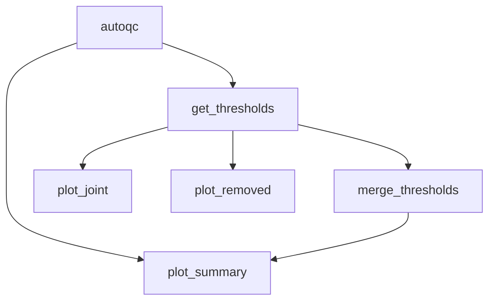

# Quality Control



*Rule graph of the `qc` module with all steps enabled, generated with `snakemake --rulegraph`. Grey rounded nodes are upstream modules; rule names correspond to the processing steps described below.*

```{include} ../../workflow/qc/README.md
:heading-offset: 1
```

## Functional description

### Inputs

- One AnnData file per `file_id` (`.zarr` or `.h5ad`), resolved from `input: qc:` (see {ref}`architecture`).
- Slots read:
  - the raw count matrix selected by `counts` (default `X`, e.g. `layers/counts`),
  - `var` (gene names: `var['feature_name']` is used instead of `var_names` if present),
  - `obs` (columns given in `hue` for plotting).
- Config keys and code defaults:
  - `scautoqc_metrics`: QC metrics that are thresholded and plotted (default `['n_counts', 'n_genes', 'percent_mito']`).
  - `scautoqc_metrics_params`: optional TSV in the format of `sctk.default_metric_params_df`, with one row per metric and
    columns `min`, `max`, `scale`, `side` and `min_pass_rate`. Its rows overwrite the sctk defaults.
  - `scautoqc_gaussian_kwargs`: keyword arguments passed to `sctk.fit_gaussian`, e.g. `n_components` or `threshold`
    (default `{}`).
  - `thresholds`, `alternative_thresholds` and `thresholds_file`: user thresholds (see Configuration above).
  - `hue` (default `[]`) and `plot_params` (`max_groups`, default 100; `plot_density`, default `false`; `dpi`, default 200).

Threshold parsing in the Snakefile, before any job runs:

```text
for each (task, file_id):
    thresholds = config.thresholds[file_id] if keyed by file_id, else config.thresholds
for each thresholds_file:                         # qc_utils.read_threshold_file
    keep columns file_id, threshold_type, and columns starting with n_counts / n_genes / percent_mito
    missing threshold_type -> 'user'; keep only rows with threshold_type in {user, alternative}
    rows of type 'user'        -> replace thresholds[file_id]              (TSV takes precedence over YAML)
    rows of type 'alternative' -> replace alternative_thresholds[file_id]
```

Threshold keys have the form `<metric>_min` / `<metric>_max`, e.g. `n_genes_min` or `percent_mito_max`.

### Processing steps

1. **`qc_autoqc`** (script `scripts/autoqc.py`, environment `qc`): computes the QC metrics and the sctk AutoQC
   thresholds.
   - Reads `counts` as `X`, plus `obs` and `var` (dask, backed). If the file has 0 cells, it writes empty outputs.
   - `sctk.calculate_qc(adata, flags={'mito': '(?i)^MT-', 'ribo': '(?i)^RP[LS]', 'hb': '(?i)^HB'})` flags gene groups by
     case-insensitive regular expression on gene names. It then calls `scanpy.pp.calculate_qc_metrics(qc_vars=...,
     percent_top=[50])` and adds `n_counts`, `log1p_n_counts`, `n_genes`, `log1p_n_genes`, `percent_<flag>`,
     `n_counts_<flag>` (flag = mito, ribo, hb) and `percent_top50` to `obs`.
   - `sctk.cellwise_qc(adata, metrics=metric_params, **scautoqc_gaussian_kwargs)` derives the thresholds. `metric_params`
     is `sctk.default_metric_params_df` updated with `scautoqc_metrics_params`. sctk's defaults (`min`, `max`, `scale`,
     `side`) are: `n_counts` (1000, –, log, min_only), `n_genes` (100, –, log, min_only),
     `percent_mito` (0.01, 20, log, max_only), `percent_ribo` (0, 100, log, both), `percent_hb` (–, 1, log, max_only),
     plus `percent_soup`, `percent_spliced` and `scrublet_score`, which are only used if they are present in `obs`.
     For every metric `m` that is present in `obs`:

     ```text
     x = log1p(obs[m]) if scale == 'log' else obs[m]          # min/max transformed the same way
     fit GaussianMixture on x restricted to [min, max] for each n in n_components (default 1..10),
         keep the model with the lowest BIC
     evaluate the summed weighted mixture pdf on 500 grid points; peak = argmax
     low  = largest grid point below peak where pdf < threshold (default 0.05)
     high = smallest grid point above peak where pdf < threshold
     side == 'min_only' -> high = max(x);  side == 'max_only' -> low = min(x)
     if fraction of cells within [low, high] < min_pass_rate:
         fall back to the fixed bounds min / max
     ```

     sctk stores the back-transformed ranges as `uns['scautoqc_ranges']` (columns `low` and `high`, one row per metric) and
     its own pass/fail call as `obs['cell_passed_qc']`. The workflow does not use this call further.
   - Writes `obs` and `uns` (other slots linked) and writes all QC metric columns of `obs` to a parquet file.
2. **`qc_get_thresholds`** (script `scripts/get_thresholds.py`, environment `qc`, local rule): combines the thresholds
   and flags each cell.
   - Merges `uns['scautoqc_ranges']` with the metric parameters. Bounds are dropped on the side that a metric does not
     filter: `low = None` for `max_only` and `high = None` for `min_only` (`parse_autoqc`).
   - Builds the thresholds (`qc_utils.get_thresholds`), each a `(min, max)` pair for every metric in `scautoqc_metrics`:
     - **sctk_autoqc**: the AutoQC ranges only.
     - **user**: the user thresholds only.
     - **updated**: starts from the AutoQC ranges, and each user-given key overwrites the corresponding AutoQC bound.
     - **alternative** (only if alternative thresholds are given): the updated thresholds, with each alternative key
       overwriting the corresponding bound.
   - For each threshold set, `apply_thresholds` checks every metric. A cell passes a metric if
     `min <= value <= max`; a missing bound is not applied, and a metric with neither bound is skipped. A cell passes the
     set if it passes all metrics, and cells with `NaN` values fail. From this the step counts `n_passed`, `n_removed`,
     `n_total`, `passed_frac` and `removed_frac`.
     The rows are stored in `uns['qc']` and written to `thresholds.tsv`.
   - Cell flags:

     ```text
     user_ok = passes(updated thresholds)                       -> obs['user_qc_status']
     if alternative thresholds:
         alt_ok = passes(alternative thresholds)                -> obs['alternative_qc_status']
         qc_status = 'passed'    if user_ok and alt_ok
                     'failed'    if not user_ok and not alt_ok
                     'ambiguous' otherwise
     else:
         qc_status = 'passed' if user_ok else 'failed'
     ```

     `obs['qc_status']` is an ordered categorical with the categories `passed`, `failed` and `ambiguous`.
     **No cells are removed** by this module. Removal is done downstream, e.g. with the `filter` module and
     `remove_by_column: {qc_status: [failed]}`.
   - The number of cells per status is written to `qc_stats.tsv`.
   - Writes `obs` and `uns`, with all other slots linked to the autoqc output.
3. **`qc_merge_thresholds`** (local rule): concatenates `thresholds.tsv` and `qc_stats.tsv` of all files of a task.
4. **`qc_plot_joint`** (script `scripts/plot_joint.py`, environment `scanpy`, up to 5 threads): draws joint scatter
   plots of pairs of QC metrics, with marginal histograms. The pairs are `(n_counts, n_genes)`, `(n_genes, percent_mito)`,
   `(n_genes, percent_ribo)`, `(n_genes, percent_hb)`, `(n_genes, scrublet_score)` and `(n_counts, scrublet_score)`; a
   pair is only drawn if both columns exist.
   - Each pair is shown on a linear scale and on a log scale (`log1p` with base 10 or 2).
   - Updated thresholds are drawn as solid lines. AutoQC thresholds are drawn as dashed lines where they differ from the
     updated ones.
   - One figure is drawn for each hue, plus one for `qc_status`. A hue is kept if it is numeric, or if it is categorical
     with between 2 and `max_groups` groups. If `plot_density` is set, a density figure is also drawn: seaborn KDE for up
     to 500k cells (subsampled to at most 300k cells above 100k cells), and Datashader with Gaussian smoothing for larger
     data.
5. **`qc_plot_removed`** (script `scripts/plot_removed.py`, environment `scanpy`): draws three plots:
   - a count plot of `qc_status`;
   - for each categorical hue, a stacked bar plot of the share of `passed`, `failed` and `ambiguous` cells per category,
     with categories sorted by the fraction of failed cells and a marginal plot of the total number of cells;
   - violin plots of each metric in `scautoqc_metrics`, split by `qc_status`.
6. **`qc_plot_summary`** (script `scripts/plot_summary.py`, environment `scanpy`): plots per task, across files.
   - Heatmaps of `n_removed` and `removed_frac` under the updated thresholds. Rows are study and columns are the
     `split_data_value`; both are parsed from the `file_id`.
   - Ridge plots of each numeric QC metric (and of `log1p_n_counts` and `log1p_n_genes`) across files, read from the
     parquet files, with threshold lines from the merged thresholds table.

### Outputs

- `<output_dir>/qc/autoqc/dataset~{dataset}/file_id~{file_id}.zarr`: intermediate AnnData with the sctk metrics in `obs`
  and `uns['scautoqc_ranges']`.
- `<output_dir>/qc/dataset~{dataset}/file_id~{file_id}/qc_metrics.parquet`: per-cell QC metrics.
- `<output_dir>/qc/dataset~{dataset}/file_id~{file_id}.zarr`: final AnnData.
  - `obs`: the QC metrics above, `cell_passed_qc` (sctk), `user_qc_status`, `alternative_qc_status` (only with
    alternative thresholds) and `qc_status`.
  - `uns`: `scautoqc_ranges` (after `parse_autoqc`) and `qc` (the thresholds table).
- `<output_dir>/qc/dataset~{dataset}/file_id~{file_id}/thresholds.tsv`: one row per threshold type
  (`sctk_autoqc`, `user`, `updated`, `alternative`), with columns `<metric>_min`/`<metric>_max` and the pass/remove counts.
- `<output_dir>/qc/dataset~{dataset}/file_id~{file_id}/qc_stats.tsv`: number of cells per `qc_status`.
- `<images>/qc/dataset~{dataset}/thresholds.tsv` and `qc_stats.tsv`: the per-file tables concatenated for each task.
- `<images>/qc/dataset~{dataset}/file_id~{file_id}/joint_plots/`: `hue={hue}.svg` (including `hue=qc_status.svg`);
  `main.svg` only if no valid hue is configured; `density.svg` only with `plot_density: true`.
- `<images>/qc/dataset~{dataset}/file_id~{file_id}/removed/`: `cells_passed_all.svg`, `by={hue}.svg` and
  `per_metric_violin.svg`.
- `<images>/qc/dataset~{dataset}/summary/`: `n_removed_heatmap.svg`, `removed_frac_heatmap.svg` and
  `ridge_plots/{metric}.svg`.

### Environments

- `qc` (sctk, scanpy): `autoqc`, `get_thresholds`
- `scanpy`: all plotting rules. Density plots of more than 500k cells also need `datashader`, which is not part of `envs/scanpy.yaml`.
