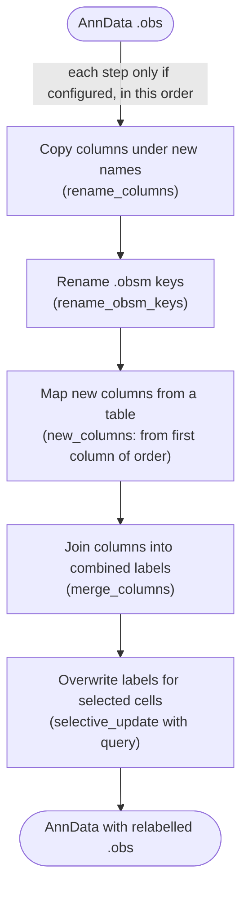

# Relabel



*Conceptual overview of the main steps of the module. See the [functional description](#functional-description) below for details.*

## Module description

```{include} ../../workflow/relabel/README.md
:heading-offset: 1
:start-line: 1
```

## Functional description

### Inputs

* **File formats:** `.h5ad` or `.zarr`, configured under `input: relabel:` (see {ref}`architecture`). For `.zarr` input only `.obs` (and `.obsm` if `rename_obsm_keys` is set) is read; for `.h5ad` the whole file is opened lazily (`dask=True, backed=True`).
* **Mapping files** (added as rule inputs): `new_columns.file` (`.tsv`, `.csv` or `.parquet`), `merge_columns.file` (TSV) and any string values of `selective_update.update_map` (TSV).
* **Config keys** (see Configuration above): `rename_columns` (`{}`), `rename_obsm_keys`, `new_columns` (`file`, `order`, optional `index_col`), `merge_columns` (`file`, `sep`, default `'-'`), `selective_update` (`base_column`, `new_column` = `base_column`, `update_map`, `query` = `'True'`), `dask` (`true`), `threads` (`1`, Dask workers). The Snakefile asserts that `new_columns` has `file` and `order` and `merge_columns` has `file` when given as dictionaries.

### Processing steps

1. **`relabel_relabel`** (script `script.py`, environment `scanpy`). One job per task × input file. The operations are applied in this fixed order:
   1. **`rename_columns`** — for each `old: new`: `obs[new] = obs[old]` (the old column is kept). If `old` does not exist, `obs[old]` is created with the string `'nan'` (and `new` is not created).
   2. **`rename_obsm_keys`** — `obsm[new] = obsm[old]`, then `del obsm[old]`; missing keys are skipped with a warning.
   3. **`new_columns`** — hierarchical mapping from a table:
      ```text
      if index_col is set: obs index (or obs[index_col] if it is a column) becomes index named index_col
      table = read(file, usecols=order, dtype=str, comment='#', NA strings -> NaN)
              # csv/tsv via dask.dataframe (rows pre-filtered to obs_names in index mode), parquet via pandas
      if index_col in table: table = table.set_index(index_col).reindex(obs_names)
                     error if no row matches
      cast each column to boolean ('true'/'false') or numeric where possible
      source = order[0]          # must be an obs column (or index_col)
      for target in order[1:]:
          if source == index_col: obs[target] = table[target]      # index mode
          else: pairs = unique (source, target) rows, whitespace-stripped
                obs[target] = obs[source].map(dict(pairs)) as category   # last pair wins
                log number of unmapped cells (NaN)
      restore original obs index
      ```
      Every target column is mapped from the first entry of `order`, not from the preceding entry.
   4. **`merge_columns`** — read the TSV, keep rows whose `file_id` equals the last `:`-separated part of the file id wildcard (warning if none), require columns `file_id`, `column_name`, `columns` and no duplicate rows; for each row: `obs[column_name] = sep.join(str(obs[c]) for c in columns.split(','))` per cell.
   5. **`selective_update`**:
      ```text
      obs[new_column] = obs[base_column].astype(str)
      for col, mapping in update_map:
          if mapping is a file: mapping = unique (col -> base_column) pairs from the TSV
          mask = obs.eval(f'({query}) & ({col}.isin(mapping keys))')
          obs.loc[mask, new_column] = obs[col].map(mapping)[mask]    # empty value -> NaN
      ```
      Later entries of `update_map` overwrite earlier ones for cells matched by both.

   Finally `.obs` (and `.obsm` if renamed) are written; all other slots are symlinked to the input (`write_zarr_linked`, `compute = not dask`). For `.h5ad` input a full zarr copy is written.

### Outputs

Relative to `<output_dir>/relabel/`:

* `dataset~<dataset>/file_id~<file_id>.zarr` — input AnnData with modified/added `.obs` columns (renamed copies, mapped categorical columns from `new_columns.order[1:]`, merged string columns, the selectively updated column) and, if configured, renamed `.obsm` keys.

### Environments

* `scanpy`
