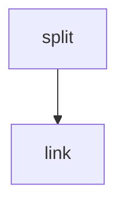

# Split Data



*Rule graph of the `split_data` module with all steps enabled, generated with `snakemake --rulegraph`. Grey rounded nodes are upstream modules; rule names correspond to the processing steps described below.*

```{include} ../../workflow/split_data/README.md
:heading-offset: 1
```

## Functional description

### Inputs

* **File formats:** `.h5ad` or `.zarr`, configured under `input: split_data:` (see {ref}`architecture`).
* **`.obs[key]`** — column to split by (config `key`, becomes wildcard `key`). Values are compared as strings.
* **Config keys** (defaults as implemented): `values` (list, exploded into one wildcard `value` per entry), `fail_on_empty_subset` (`false`), `write_copy` (`false`; forced to `true` for `.h5ad` input), `dask` (`false`), `slots` (`{}` = all slots present in the file, determined with `check_slot_exists`), `threads` (`1`, Dask workers).
* Requested `values` are matched against *sanitised* category names, in which spaces and `/` are replaced by `_` (e.g. `CD4+/CD25 T Reg` → `CD4+_CD25_T_Reg`).

### Processing steps

1. **`split_data_split`** (script `scripts/split_anndata.py`, environment `scanpy`). One job per task × input file × `key`, writing all requested values at once.
   ```text
   slots = config slots or all existing slots
   excluded = ALL_SLOTS not in slots                     # will be absent from the output
   if not write_copy and slots is an identity mapping:
       read only obs, var, uns (everything else will be linked)
   else: read slots (+ uns), backed=True, dask=True
   obs[key] = obs[key].astype(str)
   name_map = {sanitise(v): v for v in unique values of obs[key]}
   if fail_on_empty_subset and some requested value not in name_map: raise ValueError
   for value in values:
       category = name_map.get(value, value)             # unknown values give an empty subset
       mask = obs[key] == category
       sub = adata[mask]
       uns['wildcards'] |= {split_data_key: key, split_data_value: category}
       if write_copy: write_zarr(sub.copy(), splits/.../value~<value>.zarr, compute=not dask)
       else:          write obs + uns + excluded slots, symlink all other slots of the input
                      and store the cell mask with them (write_zarr_linked(subset_mask=(mask, None)))
   touch <key>.done
   ```
2. **`split_data_link`** (script `scripts/link_zarr.py`, environment `scanpy`, local rule). One job per `value`: creates the final `value~<value>.zarr` directory and symlinks every top-level entry of the corresponding file in `splits/` into it (`link_zarr(overwrite=True)`); fails if the split file does not exist. This rule turns the single multi-output split job into one output file per wildcard combination so downstream modules can consume each split separately.

### Outputs

Relative to `<output_dir>/split_data/`:

* `splits/dataset~<dataset>/file_id~<file_id>/key~<key>/value~<value>.zarr` — the actual split objects; `splits/…/key~<key>.done` — completion flag.
* `dataset~<dataset>/file_id~<file_id>/key~<key>/value~<value>.zarr` — directory whose slots are symlinks to the split above (final output used downstream).
* Each split contains the selected cells, all genes, `.obs[key]` cast to string and `.uns['wildcards']['split_data_key' | 'split_data_value']`.

### Environments

* `scanpy`
