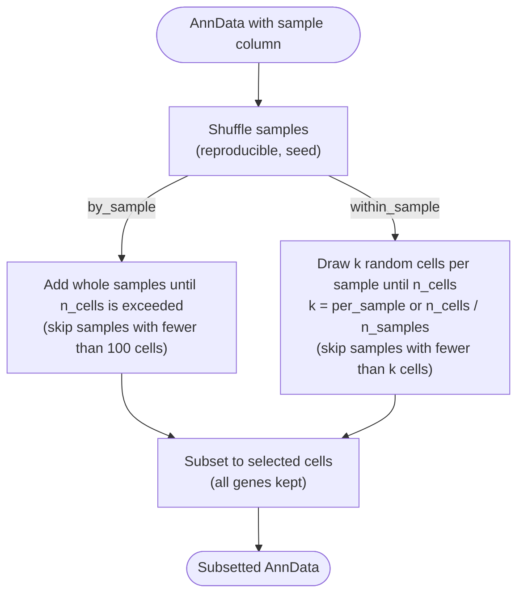

# Subset



*Conceptual overview of the main steps of the module. See the [functional description](#functional-description) below for details.*

## Module description

```{include} ../../workflow/subset/README.md
:heading-offset: 1
:start-line: 1
```

## Functional description

### Inputs

* **File formats:** `.h5ad` or `.zarr`, configured under `input: subset:` (see {ref}`architecture`). The whole object is opened lazily (`read_anndata(backed=True, dask=True)`); only `.obs` is used for the decision.
* **`.obs[sample_key]`** (config `sample_key`, no default; the job fails with an assertion if the column is missing).
* **Config keys:** `strategy` (`by_sample` or `within_sample`), `n_cells` (if unset: no upper limit, `np.iinfo(int).max`), `per_sample` (only `within_sample`), `seed` (default `42`). `label` is accepted in the configuration but not used by the script.

### Processing steps

1. **`subset_subset`** (script `scripts/run.py`, functions in `scripts/subset_functions.py`, environment `scanpy`). One job per task × input file.
   Samples are first shuffled reproducibly: `obs[sample_key].value_counts().sample(frac=1, random_state=seed)`.

   *`by_sample`* — keeps complete samples:
   ```text
   selected = []; n = 0
   for sample, count in shuffled samples:
       if selected and n > n_cells: stop
       if count < 100: skip                       # min_cells_per_sample, not configurable
       selected.append(sample); n += count
   mask = obs[sample_key] in selected
   ```
   The last sample that crosses `n_cells` is still added, so the result can exceed `n_cells` by up to one sample.

   *`within_sample`* — draws a fixed number of cells per sample:
   ```text
   k = per_sample or int(n_cells / n_samples)
   for sample in shuffled samples:
       cells = obs_names of sample
       if len(cells) < k: skip sample             # small samples are dropped, not down-weighted
       draw k cells without replacement (pandas .sample, random_state=seed)
       if total drawn >= n_cells: stop
   obs['subset'] = True for drawn cells, False otherwise; mask = obs['subset']
   ```
   Because `run.py` replaces an unset `n_cells` by the maximum integer, setting neither `n_cells` nor `per_sample` makes `k` larger than any sample, so no cells are selected and the job fails.
   (A third entry, `scarf_TopACeDo`, exists in the strategy map but is an unimplemented stub.)

   The AnnData is subset to the mask and `.uns['subset']` is set. Only `.obs` and `.uns` are written; all other slots of a `.zarr` input are symlinked and the cell mask is stored alongside them so they are subset on read (`write_zarr_linked(subset_mask=(mask, all genes))`). For `.h5ad` input the full subset is written instead.

### Outputs

Relative to `<output_dir>/subset/`:

* `dataset~<dataset>/file_id~<file_id>.zarr` — AnnData restricted to the selected cells (all genes kept) with
  * `.uns['subset'] = {strategy, n_cells, sample_key, per_sample, seed}`,
  * `.obs['subset']` (all `True`) — only for `within_sample`.

### Environments

* `scanpy`
