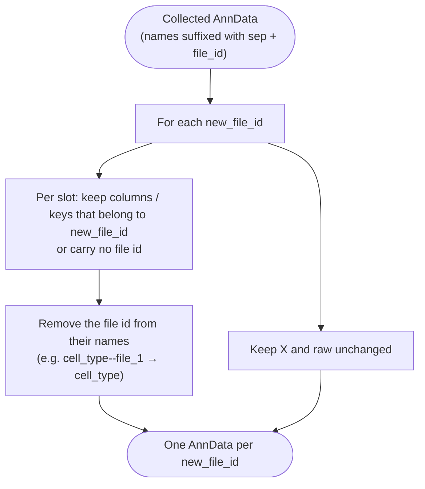

# Uncollect



*Conceptual overview of the main steps of the module. See the [functional description](#functional-description) below for details.*

```{include} ../../workflow/uncollect/README.md
:heading-offset: 1
```

## Functional description

### Inputs

* **File formats:** one `.zarr` (preferred; enables linking) or `.h5ad` file per task/file id, configured under `input: uncollect:` (see {ref}`architecture`), typically the output of [collect](collect.md).
* **All top-level slots** present in the file are processed. For `.zarr` input, `X`, `layers`, `obsm`, `obsp` and `uns` are not loaded; only their key names are read and the data are later symlinked.
* **Config keys:** `new_file_ids` (list, exploded into one wildcard `new_file_id` per entry) and `sep` (default `'--'`).

### Processing steps

1. **`uncollect_uncollect`** (script `uncollect.py`, environment `scanpy`). One job per input file × `new_file_id`. A name (column or key) *matches* `new_file_id` if it does not contain `sep` at all, or if every `sep`-separated component of `new_file_id` occurs among the `sep`-separated components of the name. Matching names are renamed by removing those components (e.g. `cell_type--file_1` → `cell_type` for `new_file_id=file_1`).
   ```text
   for slot in slots of the input file:
       DataFrame (obs, var): keep matching columns, strip the file id from their names
       dict-like (layers, obsm, obsp, uns, ...):
           zarr: for matching keys, symlink <slot>/<key> of the input as <slot>/<stripped key>
           h5ad: rebuild the dict with stripped key names (see note below)
       X, raw: zarr: symlink; h5ad: copy
   create AnnData from the kept DataFrames/dicts, compute dask arrays
   write_zarr_linked(files_to_keep = processed slots, slot_map = key-level links)
   ```
   Note: in the `.h5ad` branch the condition is inverted relative to the `.zarr` branch (keys that do **not** match are kept), so `.zarr` input is the tested path.

### Outputs

Relative to `<output_dir>/uncollect/`:

* `dataset~<dataset>/file_id~<file_id>/new_file_id~<new_file_id>.zarr` — AnnData containing, per slot, only the columns/keys that belong to `new_file_id` or carry no file id, with the `<sep><new_file_id>` suffix removed.

### Environments

* `scanpy`
